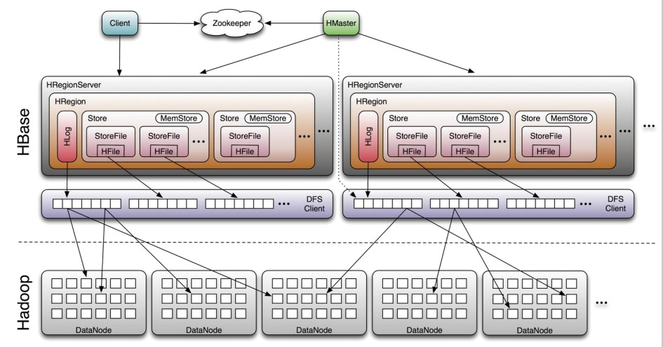

# 深入了解HBase结构

## HBase 结构组成那个

HBase采用Master/slave结构搭建集群，它属于Hadoop生态系统，由以下类型的节点组成：HMaster节点、HRegion节点、Zookeeper集群，而在底层，它将数据存储与hdfs中，因而涉及hdfs的NameNode、DataNode等。总体结构如下图所示：

### HMaster节点

1. 管理HRegionServer，实现其负载均衡。
2. 管理和分配HRegion，比如在HRegion split时分配新的HRegion；在HRegionServer退出时迁移其内的HRegion到其他HRegionServer上。
3. 实现DDL操作。
4. 管理namespace和table的元数据(实际存储在hdfs上)
5. 权限控制(ACL)

### HRegionServer节点

1. 存放和管理本地HRegion
2. 读写HDFS，管理Table中的数据。
3. Client直接通过HRegionServer读写数据(从HMaster中获取元数据，找到RowKey所在的HRegion/HRegionServer后)

### Zookeeper集群协调系统

1. 存放整个HBase集群的元数据以及集群的状态信息
2. 实现HMaster主从节点的failover

## 参考博文

[An In-Depth Look at the HBase Architecture](https://mapr.com/blog/in-depth-look-hbase-architecture/#.VdMxvWSqqko)
