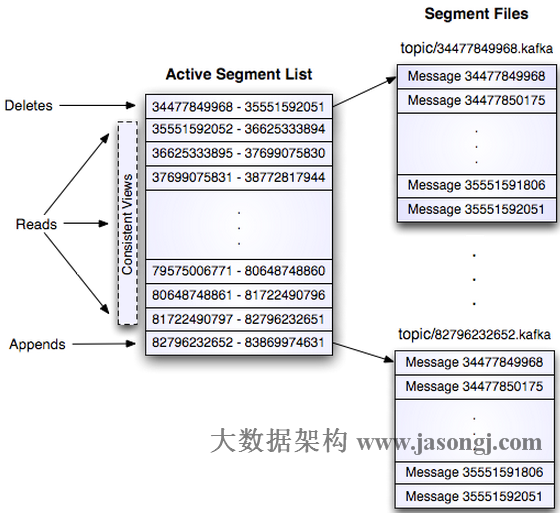
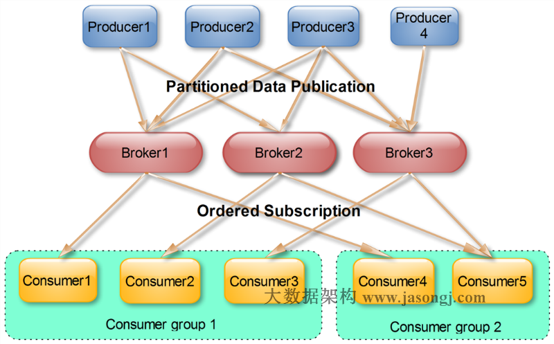

# Kafka背景及架构介绍

Kafka是由LinkedIn开发的一个分布式的消息系统，使用Scala编写，它以可水平扩展和高吞吐率而被广泛使用。目前越来越多的开源分布式处理系统如Cloudera、Apache Storm、Spark都支持与Kafka集成。InfoQ一直在紧密关注Kafka的应用以及发展，“Kafka剖析”专栏将会从架构设计、实现、应用场景、性能等方面深度解析Kafka。

## 背景介绍

### Kafka创建背景

Kafka是一个消息系统，原本开发自LinkedIn，用作LinkedIn的活动流（Activity Stream）和运营数据处理管道（Pipeline）的基础。现在它已被多家不同类型的公司 作为多种类型的数据管道和消息系统使用。

活动流数据是几乎所有站点在对其网站使用情况做报表时都要用到的数据中最常规的部分。活动数据包括页面访问量（Page View）、被查看内容方面的信息以及搜索情况等内容。这种数据通常的处理方式是先把各种活动以日志的形式写入某种文件，然后周期性地对这些文件进行统计分析。运营数据指的是服务器的性能数据（CPU、IO使用率、请求时间、服务日志等等数据)。运营数据的统计方法种类繁多。

近年来，活动和运营数据处理已经成为了网站软件产品特性中一个至关重要的组成部分，这就需要一套稍微更加复杂的基础设施对其提供支持。

### Kafka简介

Kafka是一种分布式的，基于发布/订阅的消息系统。主要设计目标如下：
- 以时间复杂度为O(1)的方式提供消息持久化能力，即使对TB级以上数据也能保证常数时间复杂度的访问性能。
- 高吞吐率。即使在非常廉价的商用机器上也能做到单机支持每秒100K条以上消息的传输。
- 支持Kafka Server间的消息分区，及分布式消费，同时保证每个Partition内的消息顺序传输。
- 同时支持离线数据处理和实时数据处理。
- Scale out：支持在线水平扩展。

### 为何使用消息系统

**解耦**
> 在项目启动之初来预测将来项目会碰到什么需求，是极其困难的。消息系统在处理过程中间插入了一个隐含的、基于数据的接口层，两边的处理过程都要实现这一接口。这允许你独立的扩展或修改两边的处理过程，只要确保它们遵守同样的接口约束。

**冗余**
> 有些情况下，处理数据的过程会失败。除非数据被持久化，否则将造成丢失。消息队列把数据进行持久化直到它们已经被完全处理，通过这一方式规避了数据丢失风险。许多消息队列所采用的"插入-获取-删除"范式中，在把一个消息从队列中删除之前，需要你的处理系统明确的指出该消息已经被处理完毕，从而确保你的数据被安全的保存直到你使用完毕。

**扩展性**
> 因为消息队列解耦了你的处理过程，所以增大消息入队和处理的频率是很容易的，只要另外增加处理过程即可。不需要改变代码、不需要调节参数。扩展就像调大电力按钮一样简单。

**灵活性 & 峰值处理能力**
> 在访问量剧增的情况下，应用仍然需要继续发挥作用，但是这样的突发流量并不常见；如果为以能处理这类峰值访问为标准来投入资源随时待命无疑是巨大的浪费。使用消息队列能够使关键组件顶住突发的访问压力，而不会因为突发的超负荷的请求而完全崩溃。

**可恢复性**
> 系统的一部分组件失效时，不会影响到整个系统。消息队列降低了进程间的耦合度，所以即使一个处理消息的进程挂掉，加入队列中的消息仍然可以在系统恢复后被处理。

**顺序保证**
> 在大多使用场景下，数据处理的顺序都很重要。大部分消息队列本来就是排序的，并且能保证数据会按照特定的顺序来处理。Kafka保证一个Partition内的消息的有序性。

**缓冲**
> 在任何重要的系统中，都会有需要不同的处理时间的元素。例如，加载一张图片比应用过滤器花费更少的时间。消息队列通过一个缓冲层来帮助任务最高效率的执行———写入队列的处理会尽可能的快速。该缓冲有助于控制和优化数据流经过系统的速度。

**异步通信**
> 很多时候，用户不想也不需要立即处理消息。消息队列提供了异步处理机制，允许用户把一个消息放入队列，但并不立即处理它。想向队列中放入多少消息就放多少，然后在需要的时候再去处理它们。

## Kafka架构

### 术语

**Broker**
> Kafka集群包含一个或多个服务器，这种服务器被称为broker

**Topic**
> 每条发布到Kafka集群的消息都有一个类别，这个类别被称为Topic。(物理上不同Topic的消息分开存储，逻辑上一个Topic的消息虽然保存于一个或多个broker上，但用户只需指定消息的Topic即可生产或者消费数据而不需要关心数据存储于何处)

**Partition**
> Partition是物理上的概念，每个Topic包含一个或多个Partition

**Producer**
> 负责发布消息到Kafka broker(生产消息)

**Consumer**
> 消息消费者，向Kafka broker读取消息的客户端。

**Consumer Group**
> 每个Consumer属于一个特定的Consumer Group(可为每个Consumer制定group name，若不指定group name则属于默认的group，并且每个Consumer自成一组)。

### Kafka拓扑结构


如上图所示，一个典型的Kafka集群中包含若干Producer(可以是web前端产生的Page View，或者是服务器日志，系统CPU、Memory等)，若干broker(Kafka支持水平扩展，一般broker数量越多，集群吞吐量越高)，若干Consumer Group，以及一个Zookeeper集群。Kafka通过Zookeeper管理集群配置，选举leader，以及在Consumer Group发生变化时进行rebalance。Producer使用push模式将消息发布到broker，Consumer使用pull模式从broker订阅并消费消息。

### Topic & Partition

Topic在逻辑上可以被认为是一个queue，每条消费都必须制定它的Topic，可以简单理解为必须指明把这条消息放进那个queue里。为了使Kafka的吞吐量可以线性提高，物理上把Topic分成一个或者多个Partiion，每个Partition在物理上对应一个文件夹，该文件夹下存储这个Partition的所有消息和索引文件。

每个日志文件都是一个`log entry`序列，每个`log entry`包含一个4字节整形数值(值为N+5),1个字节的`magic value`，4个字节的CRC校验码，其后跟N个字节的消息体。每条消息都有一个当前的Partition下唯一的64字节的offset，它指明了这条消息的起始位置。磁盘山存储的消息格式如下：
```
message length ： 4 bytes (value: 1+4+n)
“magic” value ： 1 byte
crc ： 4 bytes
payload ： n bytes
```
这个`log entry`并非由一个文件构成，而是分成多个segment，每个segment以该segment第一条消息的offset命名并以`.kafka`为后缀。另外会有一个索引文件，它标明了每个segment下包含的`log entry`的offset范围，如下图所示。



因为每条消息都被append到该Partition中，属于顺序写磁盘，因此效率非常高（经验证，顺序写磁盘效率比随机写内存还要高，这是Kafka高吞吐率的一个很重要的保证）。


对于传统的message queue而言，一般会删除已经被消费的消息，而Kafka集群会保留所有的消息，无论其被消费与否。当然，因为磁盘限制，不可能永久保留所有数据（实际上也没必要），因此Kafka提供两种策略删除旧数据。一是基于时间，二是基于Partition文件大小。例如可以通过配置$KAFKA_HOME/config/server.properties，让Kafka删除一周前的数据，也可在Partition文件超过1GB时删除旧数据，配置如下所示。

```
# 日志保存时间
log.retention.hours=168
# 日志段文件的最大值，当超过这个值时将创建一个新的日志段
log.segment.bytes=1073741824
# 检查日志段的时间间隔，看看是否可以根据保留策略删除它们
log.retention.check.interval.ms=300000
# 启用清理日志
log.cleaner.enable=false
```
　这里要注意，因为Kafka读取特定消息的时间复杂度为O(1)，即与文件大小无关，所以这里删除过期文件与提高Kafka性能无关。选择怎样的删除策略只与磁盘以及具体的需求有关。另外，Kafka会为每一个Consumer Group保留一些metadata信息——当前消费的消息的position，也即offset。这个offset由Consumer控制。正常情况下Consumer会在消费完一条消息后递增该offset。当然，Consumer也可将offset设成一个较小的值，重新消费一些消息。因为offet由Consumer控制，所以Kafka broker是无状态的，它不需要标记哪些消息被哪些消费过，也不需要通过broker去保证同一个Consumer Group只有一个Consumer能消费某一条消息，因此也就不需要锁机制，这也为Kafka的高吞吐率提供了有力保障。

### Producer消息路由

Producer发送消息到broker时，会根据Paritition机制选择将其存储到哪一个Partition。如果Partition机制设置合理，所有消息可以均匀分布到不同的Partition里，这样就实现了负载均衡。如果一个Topic对应一个文件，那这个文件所在的机器I/O将会成为这个Topic的性能瓶颈，而有了Partition后，不同的消息可以并行写入不同broker的不同Partition里，极大的提高了吞吐率。可以在`$KAFKA_HOME/config/server.properties`中通过配置项`num.partitions`来指定新建Topic的默认Partition数量，也可在创建Topic时通过参数指定，同时也可以在Topic创建之后通过Kafka提供的工具修改。

在发送一条消息时，可以指定这条消息的key，Producer根据这个Key和Partiton机制来判断应该将这条消息发送到那个Partition。Partition机制可以通过指定Producer的`paritition. class`这一参数来指定，该class必须实现`kafka.producer.Partitioner`接口。本例中如果key可以被解析为整数则将对应的整数与Partition总数取余，该消息会被发送到该数对应的Partition。（每个Parition都会有个序号,序号从0开始）
```java
import kafka.producer.Partitioner;
import kafka.utils.VerifiableProperties;
public class JasonPartitioner<T> implements Partitioner {
    public JasonPartitioner(VerifiableProperties verifiableProperties) {}

    @Override
    public int partition(Object key, int numPartitions) {
        try {
            int partitionNum = Integer.parseInt((String) key);
            return Math.abs(Integer.parseInt((String) key) % numPartitions);
        } catch (Exception e) {
            return Math.abs(key.hashCode() % numPartitions);
        }
    }
}
```

### Consumer Group

（本节所有描述都是基于Consumer hight level API而非low level API）。

使用Consumer high level API时，同一Topic的一条消息只能被同一个Consumer Group内的一个Consumer消费，但多个Consumer Group可同时消费这一消息。



这是Kafka用来实现一个Topic消息的广播（发给所有的Consumer）和单播（发给某一个Consumer）的手段。一个Topic可以对应多个Consumer Group。如果需要实现广播，只要每个Consumer有一个独立的Group就可以了。要实现单播只要所有的Consumer在同一个Group里。用Consumer Group还可以将Consumer进行自由的分组而不需要多次发送消息到不同的Topic。

### Push vs. Pull

作为一个消息系统，Kafka遵循了传统的方式，选择由Producer向broker push消息并由Consumer从broker pull消息。一些logging-centric system，比如Facebook的Scribe和Cloudera的Flume，采用push模式。事实上，push模式和pull模式各有优劣。

push模式很难适应消费速率不同的消费者，因为消息发送速率是由broker决定的。push模式的目标是尽可能以最快速度传递消息，但是这样很容易造成Consumer来不及处理消息，典型的表现就是拒绝服务以及网络拥塞。而pull模式则可以根据Consumer的消费能力以适当的速率消费消息。

对于Kafka而言，pull模式更合适。pull模式可简化broker的设计，Consumer可自主控制消费消息的速率，同时Consumer可以自己控制消费方式——即可批量消费也可逐条消费，同时还能选择不同的提交方式从而实现不同的传输语义。

　　


--------------

本文转发自技术世界，原文链接　[http://www.jasongj.com/2015/03/10/KafkaColumn1/](http://www.jasongj.com/2015/03/10/KafkaColumn1)
