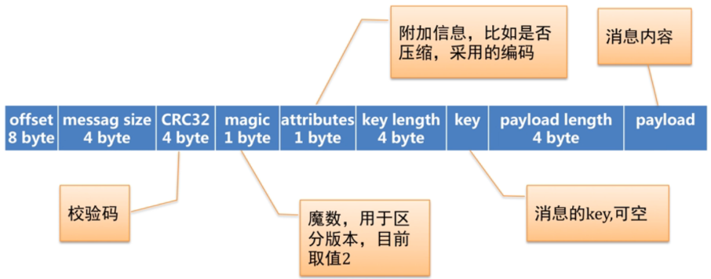
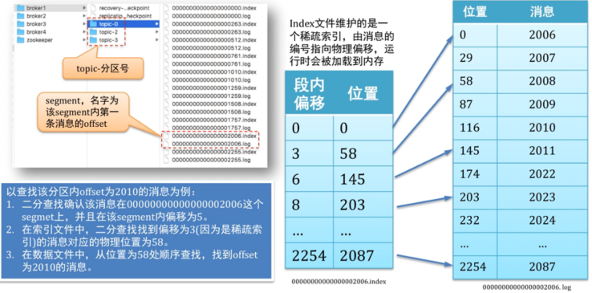
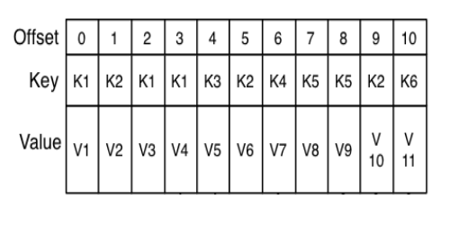
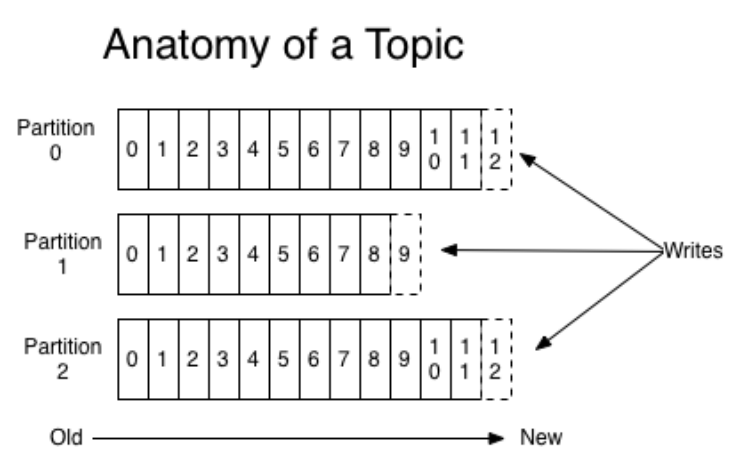
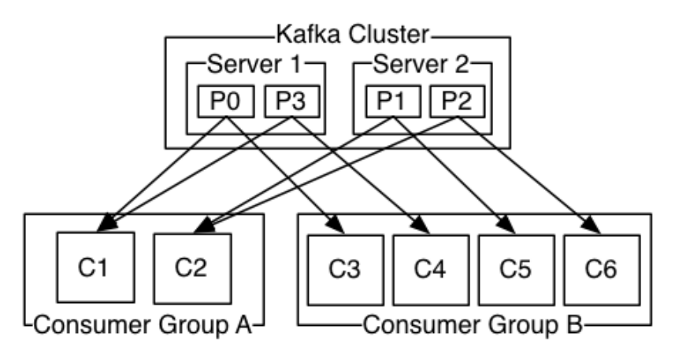

# Kafka内核总结

## 1 Message

一个kafka的Message由一个固定长度的header和一个变长的消息体body组成。

header部分由一个字节的magic(文件格式)和四个字节的CRC32(用于判断body消息体是否正常)构成。当magic的值为1时，会在magic和CRC32之间多一个字节的数据:attributes(保存一些相关属性，比如是否压缩、压缩格式等信息)；如果magic的值为0，那么不存在attributes属性。

body是由N个字节构成的一个消息体，包含了具体的key/value消息

存储在磁盘的日志采用不同于Producer发送的消息格式，每个日志文件都是一个"log entries"序列，每一个log entry包含一个offset(占8字节)信息，message size(四字节，整个log entry的长度)，CRC32(4字节)，magic(1字节)，attributes(1字节)，key length(4字节)，key(实际的key的值，它的长度是key length)，payload length(4字节，表示实际内容所占的长度)，payload(实际存放的内容)。log entry的具体格式如下图所示：

这个log entries并非由一个文件构成，而是分成多个segment file(日志文件，存储具体的消息记录)和一个索引文件(存储每个segment文件的offset偏移量范围)。结构如下图所示：

## 2 消息存储机制

一个topic分为多个Partition来进行数据管理，一个partition中的数据是有序的、不可变的，使用偏移量(offset)唯一标识一条数据，是一个long类型的数据。

Partition接收到 producer发送过来数据后，会产生一个递增的offset偏移量数据，同时将数据保存到本地的磁盘文件中(文件内容追加的方式写入数据)；partition中的数据存活时间超过参数值(log.retention.{ms,minutes,hours},默认为7天)的时候进行删除。

Consumer根据offset消费对应topic的partition中的数据(也就是每个consumer消费的每个topic的partition都拥有自己的offset偏移量)
**注意**：kafka的数据消费是顺序读写的，磁盘的顺序读写速度(600MB/SEC)比随机读写速度(100K/SEC)要快得多。

> Tip:
> 硬盘的顺序读写比内存的随机读写速度要快
> 硬盘的主要性能消耗是寻道和旋转延时，真正用于读写数据的时间很少，顺序读写避免了过多的寻道和旋转延时。
> kafka将文件写到内存的页缓存，然后按定制的策略flush到硬盘，默认且推荐的策略是不配置下面的参数而是依赖操作系统的flush策略。
> - log.flush.interval.messages
> - log.flush.interval.ms
> - log.flush.scheduler.interval.ms

## 3 分布式机制

一个Topic中的所有数据分布式的存储在kafka集群的所有机器(broker)上，以分区(partition)的形式进行数据存储；每个分区允许存在备份数据/备份分区(存储在同一个kafka集群的其它broker上的分区)

每个数据分区在kafka集群中存在一个broker节点上的分区叫做leader，存储在其它broker上的备份分区叫做followers；只有leader节点负责该分区的数据读写操作followers节点作为leader节点的热备节点，从leader节点备份数据；当leader节点挂掉的时候，followers节点中会有一个节点变成leader节点，重新提供服务。kafka集群的分区partition的leader和followers切换依赖zookeeper。

kafka分布式保证的第一个特性就是：kafka的Replication，Kafka的Replication指的是Partition的复制，一个Partition的所有分区中只有一个分区是leader节点，其它分区是follower节点。

Replication对Kafka的吞吐率有一定的影响，但是极大的增强了可用性follower节点会定时的从leader节点上获取增量数据，一个活跃的follower节点必须满足以下两个条件：
1. 所有的节点必须维护和zookeeper的连接(通过zk的heartbeat实现)
2. follower必须能够及时的将leader上的writing复制过来，不能落后太多；落后太多由 参数{replica.lag.time.max.ms}和{replica.lag.max.messages}决定。

kafka分布式保证的第二个特性就是 ：kafka leader election

kafka提供了一个in-syc replicas(ISR)来确保kafka的leader选举，ISR是一个保存分区node的集合，如果一个node宕机了或数据落后太多，leader会将node节点从ISR中移除，之后ISR中的follower节点才有可能成为leader节点

leader节点的切换基于zookeeper的watcher机制，当leader节点宕机的时候，其他ISR中的follower节点会竞争在zk中创建一个文件目录(只有一个follower节点创建成功)，创建成功的follower节点成为leader节点。

## 4 消息的收集/消费机制

### 4.1 kafka数据收集机制

kafka集群中由producer负责数据的生产，并发送到对应的topic；producer通过push的方式将数据发送到对应的topic的分区。

producer发送到topic的数据是由key/value键值对组成，kafka根据key的不同的值决定数据发送到不同的partition，默认采用hash的机制发送数据到对应topic的不同partiiton中，配置参数为{partitioner.class}

producer发送数据的方式分为sync(同步)和async(异步)两种，默认为同步的方式，由参数{producer.type}决定；当为异步发送模式的时候priducer提供重试机制，默认失败重试发送3次

## 4.2 kafka数据消费机制

kafka有两种模式消费数据：队列和发布订阅；在队列模式下，一条数据只会发送给customer group中的一个customer进行消费；在发布订阅模式下，一条数据会发送给多个customer进行消费。

kafka的customer基于offset对kafka中的数据进行消费，对于一个customer group中的所有customer共享一个offset偏移量。

kafka中通过控制customer的参数{group.id}来决定kafka是什么数据消费模式，如果所有消费者的该参数值是相同的，那么此时的kafka就是类似于队列模式数据只会发送到一个customer，此时kafka类似于负载均衡；否则就是发布订阅模式；在队列模式下，可能会触发kafka的Consumer Rebalance。

kafka的数据是按照分区进行排序的(插入的顺序)，也就是每个分区中的数据是有序的，在consumer进行数据消费时候，也是对分区的数据进行有序的消费，但是不保证所有数据的有序性(在多个分区之间)

consumer rebalance：当一个consumer group中的消费者数量和对应的topic分区数量一致的时候，此时一个consumer消费一个partition的数据；如果不一致，那么可能出现一个consumer消费多个partition的数据或者不消费数据的情况，这个机制是根据consumer和partition的数量同台变化的。

consumer通过poll的方式主动从kafka集群中获取数据：

## 参考博文

[http://www.cnblogs.com/liuming1992/p/6425492.html](http://www.cnblogs.com/liuming1992/p/6425492.html)

[http://www.cnblogs.com/liuming1992/p/6425523.html](http://www.cnblogs.com/liuming1992/p/6425523.html)

[http://www.cnblogs.com/liuming1992/p/6425536.html](http://www.cnblogs.com/liuming1992/p/6425536.html)

[http://www.cnblogs.com/liuming1992/p/6425572.html](http://www.cnblogs.com/liuming1992/p/6425572.html)
