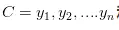

# 带你搞懂朴素贝叶斯分类算法

贝叶斯分类是一类分类算法的总称，这类算法均以贝叶斯定理为基础，故称为贝叶斯分类。而朴素贝叶斯分类是贝叶斯分类中最简单，也是最常见的一种分类算法。这篇文章我尽可能用直白的话语总结一下我们学习会上讲到的朴素贝叶斯分类算法，希望有利于他人理解。

## 1 分类问题综述

对于分类问题，其实谁都不会陌生，日常生活中我们每天都进行着分类过程。例如，当你看到一个人，你的脑子下意识判断他是学生还是社会上的人；你可能经常会走在路上对身旁的朋友说“这个人一看就很有钱”之类的话，其实这就是一种分类操作。

> 既然是贝叶斯分类算法，那么分类的数学描述又是什么呢？

从数学角度来说，分类问题可做如下定义：已知集合 和,确定映射规则`y = f(x)`，使得任意有且只有一个,使得成立。

其中C叫做类别集合，其中每个元素是一个类别，而I叫做项集合(特征集合)，其中每一个元素是一个待分类项，f叫做分类器。分类算法的任务就是构造分类器f。

分类算法的内容是要求给定特征，让我们得出类别，这也是所有分类问题的关键。那么如何由指定特征，得到我们最终的类别，也是我们下面要讲的，每个不同的分类算法，对应着不同的核心思想。

本篇文章，我会用一个具体实例，对朴素贝叶斯算法几乎所有重要的知识点进行讲解。

## 2 朴素贝叶斯分类

那么既然是朴素贝叶斯分类算法，它的核心算法又是什么呢？

是下面这个贝叶斯公式：

换个表达形式就会明朗很多，如下：

我们最终求的p(类别|特征)即可！就相当于完成了我们的任务。

## 3 例题分析

下面我们先给出例子问题。

给定数据如下：

现在给我们的问题是，如果一对男女朋友，男生向女生求婚，男生的四个特征分别是不帅，性格不好，身高矮，不上进，请你判断一下女生是嫁还是不嫁？

这是一个典型的分类问题，转为数学问题就是比较p(嫁|(不帅、性格不好、身高矮、不上进))与p(不嫁|(不帅、性格不好、身高矮、不上进))的概率，谁的概率大，我就能给出嫁或者不嫁的答案！

这里我们联系到朴素贝叶斯公式：

我们需要求p(嫁|(不帅、性格不好、身高矮、不上进),这是我们不知道的，但是通过朴素贝叶斯公式可以转化为好求的三个量.

p(不帅、性格不好、身高矮、不上进|嫁)、p（不帅、性格不好、身高矮、不上进)、p(嫁)（至于为什么能求，后面会讲，那么就太好了，将待求的量转化为其它可求的值，这就相当于解决了我们的问题！）

## 4 朴素贝叶斯算法的朴素一词解释

那么这三个量是如何求得？

是根据已知训练数据统计得来，下面详细给出该例子的求解过程。
回忆一下我们要求的公式如下：

那么我只要求得p(不帅、性格不好、身高矮、不上进|嫁)、p（不帅、性格不好、身高矮、不上进)、p(嫁)即可，好的，下面我分别求出这几个概率，最后一比，就得到最终结果。

p(不帅、性格不好、身高矮、不上进|嫁) = p(不帅|嫁)*p(性格不好|嫁)*p(身高矮|嫁)*p(不上进|嫁)，那么我就要分别统计后面几个概率，也就得到了左边的概率！

等等，为什么这个成立呢？学过概率论的同学可能有感觉了，这个等式成立的条件需要特征之间相互独立吧！

对的！这也就是为什么朴素贝叶斯分类有朴素一词的来源，朴素贝叶斯算法是假设各个特征之间相互独立，那么这个等式就成立了！

> 但是为什么需要假设特征之间相互独立呢？

1. 我们这么想，假如没有这个假设，那么我们对右边这些概率的估计其实是不可做的，这么说，我们这个例子有4个特征，其中帅包括{帅，不帅}，性格包括{不好，好，爆好}，身高包括{高，矮，中}，上进包括{不上进，上进}，那么四个特征的联合概率分布总共是4维空间，总个数为2*3*3*2=36个。 36个，计算机扫描统计还可以，但是现实生活中，往往有非常多的特征，每一个特征的取值也是非常之多，那么通过统计来估计后面概率的值，变得几乎不可做，这也是为什么需要假设特征之间独立的原因。
2. 假如我们没有假设特征之间相互独立，那么我们统计的时候，就需要在整个特征空间中去找，比如统计p(不帅、性格不好、身高矮、不上进|嫁),我们就需要在嫁的条件下，去找四种特征全满足分别是不帅，性格不好，身高矮，不上进的人的个数，这样的话，由于数据的稀疏性，很容易统计到0的情况。 这样是不合适的。

根据上面俩个原因，朴素贝叶斯对条件概率分布做了条件独立性的假设，由于这是一个较强的假设，朴素贝叶斯也由此得名！这一假设使得朴素贝叶斯变得简单，但有时会牺牲一定的分类准确率。

好的，上面我解释了为什么可以拆成分开连乘形式。那么下面我们就开始求解！

我们将上面公式整理一下如下：

下面我将一个一个的进行统计计算（在数据量很大的时候，根据中心极限定理，频率是等于概率的，这里只是一个例子，所以我就进行统计即可）。

p(嫁)=？
首先我们整理训练数据中，嫁的样本数如下：

则 p(嫁) = 6/12（总样本数） = 1/2

p(不帅|嫁)=？统计满足样本数如下：

则p(不帅|嫁) = 3/6 = 1/2 在嫁的条件下，看不帅有多少

p(性格不好|嫁)= ？统计满足样本数如下：

则p(性格不好|嫁)= 1/6

p（矮|嫁） = ?统计满足样本数如下：

## 参考博文

[https://mp.weixin.qq.com/s?__biz=MzI4MDYzNzg4Mw==&mid=2247483819&idx=1&sn=7f1859c0a00248a4c658fa65f846f341&chksm=ebb4397fdcc3b06933816770b928355eb9119c4c80a1148b92a42dc3c08de5098fd6f278e61e#rd](https://mp.weixin.qq.com/s?__biz=MzI4MDYzNzg4Mw==&mid=2247483819&idx=1&sn=7f1859c0a00248a4c658fa65f846f341&chksm=ebb4397fdcc3b06933816770b928355eb9119c4c80a1148b92a42dc3c08de5098fd6f278e61e#rd)
