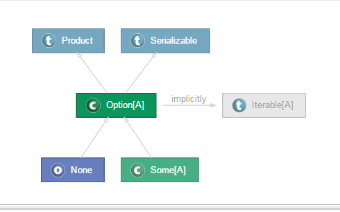

# Scala模式匹配
## 1 前言
Scala中的模式匹配可以看成是更好的java switch语句。比如如下java代码：
```java
public void testSwitch(){
  for(int i = 0; i < 100; i++){
    switch(i){
      case 10 :
        System.out.println("10");
        break;
      case 50 :
        System.out.println("50");
      //由于没有break所以会调入下一个分支
      case 80 :
        System.out.println("80");
      default :
        break;
    }
  }
}
```
scala通过模式匹配解决了java switch中存在的这个问题，并且scala的模式匹配功能更加强大，请看如下代码：
```scala
def testMatch {
  for(i <- 1 to 100){
    i match{
      case 10 => println(10)
      case 50 => println(50)
      case 80 => println(80)
      case _  =>
    }
  }
}
```
上述scala代码展示了简单的模式匹配，它的实现方式是通过match关键字与case x=>的方式实现的，其中case _表示出了上述条件的其余匹配，类似于java中的default。

## 2 守卫条件

scala语言提供了更加灵活的模式匹配，你可以添加守卫条件，守卫可以是任何boolean的条件。
```scala
def testMatch {
  for(i <- 1 to 100){
    i match{
      case 0 => println(0)
      // 守卫条件
      case _ if(i % 2 == 0) => println("i是偶数")
      case _ if(i % 2 != 0) => println("i是奇数")
      case _ =>
    }
  }
}
```

## 3 模式的类型

### 3.1 常量模式

```scala
object ConstantPattern{
  def main(args: Array[String]): Unit = {
    //注意，下面定义的是一个函数
    //函数的返回值利用的是模式匹配后的结果作为其返回值
    //还需要注意的是函数定义在main方法中
    //也即scala语言可以在一个函数中定义另外一个函数
    def patternShow(x:Any)=x match {
      case 5 => "five"
      case true=>"true"
      case "test"=>"String"
      case null=>"null"
      case Nil=>"empty list"
      case _  =>"Other constant"
    }
    println(patternShow(5))
  }
}
```

### 3.2 变量模式

```scala
object VariablePattern{
  def main(args: Array[String]): Unit = {
    def patternShow(x:Any)=x match {
      case 5 => "five"
      //所有不是值为5的都会匹配变量y
      //例如"xxx"，则函数的返回结果就是"xxx"
      case y => y
    }
    println(patternShow("xxx"))
  }
}
```

### 3.3 构造器模式

```scala
//构造器模式必须将类定义为case class
case class Person(name:String,age:Int)
object ConstructorPattern {
  def main(args: Array[String]): Unit = {
      val p=new Person("摇摆少年梦",27)
      def constructorPattern(p:Person)=p match {
        case Person(name,age) => "Person"
        case _ => "Other"
      }
  }
}
```

### 3.4 序列(Sequence)模式

序列模式指的是像Array、List这样的序列集合进行模式匹配
```scala
object SequencePattern {
  def main(args: Array[String]): Unit = {
      val p=List("spark","hive","SparkSQL")
      def sequencePattern(p:List[String])=p match {
        //只需要匹配第二个元素
        case List(_,second,_*) => second
        case _ => "Other"
      }
      println(sequencePattern(p))
  }
}
```

### 3.5 元组模式

```scala
//匹配某个元组内容
object TuplePattern {
  def main(args: Array[String]): Unit = {
      val t=("spark","hive","SparkSQL")
      def tuplePattern(t:Any)=t match {
        case (one,_,_) => one
        case _ => "Other"
      }
      println(tuplePattern(t))
  }
}
```

### 3.6 类型模式

```scala
//匹配传入参数的类型
object TypePattern {
  def main(args: Array[String]): Unit = {

      def tuplePattern(t:Any)=t match {
        case t:String=> "String"
        case t:Int => "Integer"
        case t:Double=>"Double"
      }
      println(tuplePattern(5.0))
  }
}
```
上述代码如果不用模式匹配的话，要实现相同的功能，可以通过下列代码实现：
```scala
def tuplePattern2(t:Any)={
        if(t.isInstanceOf[String]) "String"
        else if(t.isInstanceOf[Int]) "Int"
        else if(t.isInstanceOf[Double]) "Double"
        else if(t.isInstanceOf[Map[_,_]]) "MAP"
      }
```

### 3.7 变量绑定模式

```scala
object VariableBindingPattern{
  def main(args:Array[String]):Unit = {
    var t = List(List(1,2,3),List(2,3,4))
    def variableBindingPattern(t:Any) = t match{
      //变量绑定，采用变量名（这里是e)
        //与@符号，如果后面的模式匹配成功，则将
        //整体匹配结果作为返回
        case List(_,e@List(_,_,_)) => e
        case _ => Nil
      }

      println(variableBindingPattern(t))
    }
  }
}

//编译执行后的输出结果为  List(2, 3, 4)
```

## 4 for控制结构中的模式匹配

```scala
object PatternInForLoop {
  def main(args: Array[String]): Unit = {
    val m=Map("china"->"beijing","dwarf japan"->"tokyo","Aerican"->"DC Washington")
    //利用for循环对Map进行模式匹配输出，
    for((nation,capital)<-m)
      println(nation+": " +capital)
  }
}
```
正则表达式中的模式匹配
```scala
object RegexMatch {
  def main(args: Array[String]): Unit = {
    val ipRegex="(\\d+)\\.(\\d+)\\.(\\d+)\\.(\\d+)".r
    for(ipRegex(one,two,three,four) <- ipRegex.findAllIn("192.168.1.1"))
    {
      println("IP子段1:"+one)
      println("IP子段2:"+two)
      println("IP子段3:"+three)
      println("IP子段4:"+four)
    }
  }
}
```

## 5 Option类型模式匹配

Option类型有两个子类型，分别是Some和None(单例对象)，下面给出的是Option类型在Scala语言中的类层次结构：



Option类其实是一个sealed class
```scala
//Option类的部分源码
sealed abstract class Option[+A] extends Product with Serializable {
  self =>

  /** Returns true if the option is $none, false otherwise.
   */
  def isEmpty: Boolean

  /** Returns true if the option is an instance of $some, false otherwise.
   */
  def isDefined: Boolean = !isEmpty
```

下面给出的分别是Some和None的源码:
```scala
/** Class `Some[A]` represents existing values of type
 *  `A`.
 *
 *  @author  Martin Odersky
 *  @version 1.0, 16/07/2003
 */
final case class Some[+A](x: A) extends Option[A] {
  def isEmpty = false
  def get = x
}


/** This case object represents non-existent values.
 *
 *  @author  Martin Odersky
 *  @version 1.0, 16/07/2003
 */
case object None extends Option[Nothing] {
  def isEmpty = true
  def get = throw new NoSuchElementException("None.get")
}
```
下面的代码演示了其如何应用到模式匹配中：
```scala
object OptionDemo extends App{
  val m = Map("hive"->2,"spark"->3,"scala"->1)
  def mapPattern(t:String) = m.get(t) match{
    case Some(x) =>println(x) ; x
    case None => println("None") ; -1
  }
  println(mapPattern("hve"))
}

//输出结果为：
//None
//-1
```

前面我们看到：None是一个case object，它同Some一样都extends Option类，只不过Some是case class。那么case object是什么呢？
```scala
//下面的类主要用于模拟Option,Some,None三个类或对象之间的关系
sealed abstract class A
case class B(name:String,age:Int) extends A
case object CaseObject extends A{

}
```
上述代码编译后，生成的字节码文件如下：
```
D:\ScalaWorkspace\ScalaChapter15\bin\cn\scala\xtwy 的目录

2015/08/01  21:26    <DIR>          .
2015/08/01  21:26    <DIR>          ..
2015/08/01  21:26               515 A.class
2015/08/01  21:26             1,809 B$.class
2015/08/01  21:26             4,320 B.class
2015/08/01  21:26             1,722 CaseObject$.class
2015/08/01  21:26             1,490 CaseObject.class
```

单从编译后生成的类来看，它们之间似乎实现方式都一样，那到底是什么样的呢？

class A的反编译后的代码如下：
```
D:\ScalaWorkspace\ScalaChapter15\bin\cn\scala\xtwy>javap -private A.class
Compiled from "CaseObject.scala"
public abstract class cn.scala.xtwy.A {
  public cn.scala.xtwy.A();
}
```
case class B对应的字节码文件反编译后如下：
```scala
D:\ScalaWorkspace\ScalaChapter15\bin\cn\scala\xtwy>javap -private B.class
Compiled from "CaseObject.scala"
public class cn.scala.xtwy.B extends cn.scala.xtwy.A implements scala.Product,sc
ala.Serializable {
  private final java.lang.String name;
  private final int age;
  public static scala.Function1<scala.Tuple2<java.lang.String, java.lang.Object>
, cn.scala.xtwy.B> tupled();
  public static scala.Function1<java.lang.String, scala.Function1<java.lang.Obje
ct, cn.scala.xtwy.B>> curried();
  public java.lang.String name();
  public int age();
  public cn.scala.xtwy.B copy(java.lang.String, int);
  public java.lang.String copy$default$1();
  public int copy$default$2();
  public java.lang.String productPrefix();
  public int productArity();
  public java.lang.Object productElement(int);
  public scala.collection.Iterator<java.lang.Object> productIterator();
  public boolean canEqual(java.lang.Object);
  public int hashCode();
  public java.lang.String toString();
  public boolean equals(java.lang.Object);
  public cn.scala.xtwy.B(java.lang.String, int);
}


//自动生成的伴生对像类
public final class cn.scala.xtwy.B$ extends scala.runtime.AbstractFunction2<java
.lang.String, java.lang.Object, cn.scala.xtwy.B> implements scala.Serializable {

  public static final cn.scala.xtwy.B$ MODULE$;
  public static {};
  public final java.lang.String toString();
  public cn.scala.xtwy.B apply(java.lang.String, int);
  public scala.Option<scala.Tuple2<java.lang.String, java.lang.Object>> unapply(
cn.scala.xtwy.B);
  private java.lang.Object readResolve();
  public java.lang.Object apply(java.lang.Object, java.lang.Object);
  private cn.scala.xtwy.B$();
}
```
case object CaseObject对应的反编译后的内容：
```scala
D:\ScalaWorkspace\ScalaChapter15\bin\cn\scala\xtwy>javap -private CaseObject.cla
ss
Compiled from "CaseObject.scala"
public final class cn.scala.xtwy.CaseObject {
  public static java.lang.String toString();
  public static int hashCode();
  public static boolean canEqual(java.lang.Object);
  public static scala.collection.Iterator<java.lang.Object> productIterator();
  public static java.lang.Object productElement(int);
  public static int productArity();
  public static java.lang.String productPrefix();
}


D:\ScalaWorkspace\ScalaChapter15\bin\cn\scala\xtwy>javap -private CaseObject$.cl
ass
Compiled from "CaseObject.scala"
public final class cn.scala.xtwy.CaseObject$ extends cn.scala.xtwy.A implements
scala.Product,scala.Serializable {
  public static final cn.scala.xtwy.CaseObject$ MODULE$;
  public static {};
  public java.lang.String productPrefix();
  public int productArity();
  public java.lang.Object productElement(int);
  public scala.collection.Iterator<java.lang.Object> productIterator();
  public boolean canEqual(java.lang.Object);
  public int hashCode();
  public java.lang.String toString();
  private java.lang.Object readResolve();
  private cn.scala.xtwy.CaseObject$();
}
```
对比上述代码不难看出，case object与case class所不同的是，case object对应反编译后的CaseObject$.cl
ass中不存在apply、unapply方法，这是因为None不需要创建对象及进行内容提取，从这个角度讲，它被定义为case object是十分合理的。

## 6 样例类(Case Class)

Case Class是一种特殊的类，能够被优化以用于模式匹配，下面代码定义了一个样例类：
```scala
abstract class Person
// case class Student
case class Student(name:String,age:Int,studentNo:Int) extends Person
// case class Teacher
case class Teacher(name:String,age:Int,teacherNo:Int) extends Person
// case class Nobody
case class Nobody(name:String) extends Person

object CaseClassDemo{
  def main(args:Array[String]):Unit = {
    // case class会自动生成apply方法，从而省去new操作
    val p : Student = Student("tom",18,2015)
    // match case
    p match{
      case Student(name,age,studentNo) => printf("%s:%d:%d\r\n",name,age,studentNo);
      case Teacher(name,age,teacherNo) => printf("%s:%d:%d\r\n",name,age,studentNo);
      case Nobody(name) => printf("%s\r\n",name);
    }
  }
}
```
当一个类被声明为case class的时候，scala会帮助我们做下面几件事情：
1. 构造器中的参数如果不被声明为var的话，它默认就是val类型的，但是一般不推荐将构造器中的参数声明为var
2. 自动创建伴生对象，同时在里面给我们实现apply方法，使得我们在使用的时候可以不直接显示的new对象
3. 伴生对象中同样会帮我们实现unapply方法，从而可以将case class应用于模式匹配。
4. 实现 自己的toString,hashCode,copy,equals方法

除此之外，case cass与其它普通的scala泪没有区别

下面给出case class Student字节码文件内容，以验证我们上述所讲的内容
```scala
//下面的代码是自动生成的伴生对象中的字节码内容
D:\ScalaWorkspace\ScalaChapter13\bin\cn\scala\xtwy>javap -private Student$.class

Compiled from "CaseClass.scala"
public final class cn.scala.xtwy.Student$ extends scala.runtime.AbstractFunction
3<java.lang.String, java.lang.Object, java.lang.Object, cn.scala.xtwy.Student> i
mplements scala.Serializable {
  public static final cn.scala.xtwy.Student$ MODULE$;
  public static {};
  public final java.lang.String toString();
  public cn.scala.xtwy.Student apply(java.lang.String, int, int);
  public scala.Option<scala.Tuple3<java.lang.String, java.lang.Object, java.lang
.Object>> unapply(cn.scala.xtwy.Student);
  private java.lang.Object readResolve();
  public java.lang.Object apply(java.lang.Object, java.lang.Object, java.lang.Ob
ject);
  private cn.scala.xtwy.Student$();
}

//下面的代码是Student类自身的字节码内容
D:\ScalaWorkspace\ScalaChapter13\bin\cn\scala\xtwy>javap -private Student.class
Compiled from "CaseClass.scala"
public class cn.scala.xtwy.Student extends cn.scala.xtwy.Person implements scala
.Product,scala.Serializable {
  private final java.lang.String name;
  private final int age;
  private final int studentNo;
  public static scala.Function1<scala.Tuple3<java.lang.String, java.lang.Object,
 java.lang.Object>, cn.scala.xtwy.Student> tupled();
  public static scala.Function1<java.lang.String, scala.Function1<java.lang.Obje
ct, scala.Function1<java.lang.Object, cn.scala.xtwy.Student>>> curried();
  public java.lang.String name();
  public int age();
  public int studentNo();
  public cn.scala.xtwy.Student copy(java.lang.String, int, int);
  public java.lang.String copy$default$1();
  public int copy$default$2();
  public int copy$default$3();
  public java.lang.String productPrefix();
  public int productArity();
  public java.lang.Object productElement(int);
  public scala.collection.Iterator<java.lang.Object> productIterator();
  public boolean canEqual(java.lang.Object);
  public int hashCode();
  public java.lang.String toString();
  public boolean equals(java.lang.Object);
  public cn.scala.xtwy.Student(java.lang.String, int, int);
}
```

## 7 Case Class应用

### 7.1 Case Class常用方法
```scala
//toString方法演示
scala> val s=Teacher("john",38,1024)
s: Teacher = Teacher(john,38,1024)

//无参copy方法演示
scala> val s1=s.copy()
s1: Teacher = Teacher(john,38,1024)

//copy方法是深度拷贝
scala> println(s eq s1)
false

//equal方法根据对象内容进行比较
scala> println(s equals s1)
true

scala> println(s == s1)
true

//hashcode方法
scala> s1.hashCode
res45: Int = 567742485

//toString方法
scala> s1.toString
res46: String = Teacher(john,38,1024)

//带一个参数的copy方法
scala> s1.copy(name="stephen")
res47: Teacher = Teacher(stephen,38,1024)
//带二个参数的copy方法
scala> s1.copy(name="stephen",age=58)
res49: Teacher = Teacher(stephen,58,1024)
//带三个参数的copy方法
scala> s1.copy(name="stephen",age=58,teacherNo=2015)
res50: Teacher = Teacher(stephen,58,2015)
```

### 7.2 多个参数的Case Class

```scala
abstract class Person
// case class Student
case class Student(name:String,age:Int,studentNo:Int) extends Person
// case class Teacher
case class Teacher(name:String,age:Int,teacherNo:Int) extends Person
// case class Nobody
case class Nobody(name:String) extends Person

// SchoolClass为接受多个Person类型的参数的类
case class SchoolClass(classDescription:String, persons : Person*)

// 下列代码给出的是其模式匹配应用示例
object CaseClassDemo{
  def main(args:Array[String]):Unit {
    val sc = SchoolClass("scala培训班",Teacher("tom",24,324),Student("zhangsan",12,2118))

    sc match{
      case SchoolClass(_,_,Student(name,age,studentNo)) => println(name)
      case _ => println("Nobody")
    }
  }
}
```

### 7.3 sealed case class

在进行模式匹配的时候，有些时候需要确保所有的可能情况都被列出，此时常常会将case class的超类定义成sealed(密封类)
```scala
// Person最前面加上sealed
sealed abstract class Person
// case class Student
case class Student(name:String,age:Int,studentNo:Int) extends Person
// case class Teacher
case class Teacher(name:String,age:Int,teacherNo:Int) extends Person
// case class Nobody
case class Nobody(name:String) extends Person

object CaseClassDemo{
  def main(args:Array[String]):Unit = {
    // case class会自动生成apply方法，从而省去new操作
    val p : Student = Student("tom",18,2015)
    // 这边仅仅给出了Student的情况，在编译时
    // 编译器会提示
    // match may not be exhaustive.It would fail on the following inputs:Nobody(_),Teacher(_,_,_)
    p match{
      case Student(name,age,studentNo) => printf("%s:%d:%d\r\n",name,age,studentNo);
    }
  }
}
```

### 7.4 Case Class在

## 参考博文

[https://yq.aliyun.com/articles/60380?spm=5176.8251999.569296.14.2c75dfe7HfF6nm](https://yq.aliyun.com/articles/60380?spm=5176.8251999.569296.14.2c75dfe7HfF6nm)

[https://yq.aliyun.com/articles/60379?spm=5176.8251999.569296.15.2c75dfe7HfF6nm](https://yq.aliyun.com/articles/60379?spm=5176.8251999.569296.15.2c75dfe7HfF6nm)
