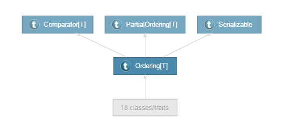
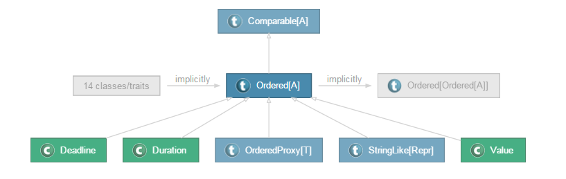

# Scala类型参数(二)

## 1 Ordering与Ordered特质

在介绍上下文界定之前，我们对scala中的Ordering和Ordered之间的关联与区别惊醒讲解，先看Ordering、Ordered的类继承层次体系：





通过上面两张图可以看到Ordering混入了java中的Comparator接口，而Ordered混入了java中的Comparable接口，我们知道java中的Comparator是一个外部比较器，而Comparable则是一个内部比较器，例如：
```java
//下面是定义的Person类（Java）
public class Person {
    private String name;
    public String getName() {
        return name;
    }
    public void setName(String name) {
        this.name = name;
    }
    Person(String name){
        this.name=name;
    }
}
//Comparator接口，注意它是在java.util包中的
public class PersonCompartor implements Comparator<Person>{

    @Override
    public int compare(Person o1, Person o2) {
        if (o1.getName().equalsIgnoreCase(o2.getName())) {
            return 1;
        }else{
            return -1;
        }
    }

    public static void main(String[] args){
        PersonCompartor pc=new PersonCompartor();
        Person p1=new Person("摇摆少年梦");
        Person p2=new Person("摇摆少年梦2");
        //下面是它的对象比较使用方式
        //可以看它，这是通过外部对象进行方法调用的
        if(pc.compare(p1, p2)>0) {
            System.out.println(p1);
        }else{
            System.out.println(p2);
        }
    }

}
```
而Comparable接口是用于内部比较，Person类自己实现Comparable接口，代码如下
```java
public class Person implements Comparable<Person>{
    private String name;
    public String getName() {
        return name;
    }
    public void setName(String name) {
        this.name = name;
    }
    Person(String name){
        this.name=name;
    }
    @Override
    public int compareTo(Person o) {
        if (this.getName().equalsIgnoreCase(o.getName())) {
            return 1;
        }else{
            return -1;
        }
    }
}

public class PersonComparable {

    public static void main(String[] args) {
        Person p1=new Person("摇摆少年梦");
        Person p2=new Person("摇摆少年梦2");
        //对象自身与其它对象比较，而不需要借助第三方
        if(p1.compareTo(p2)>0) {
            System.out.println(p1);
        }else{
            System.out.println(p2);
        }

    }

}
```
从上述代码中可以看到Comparable与Comparator接口两者的本质不同，因此Ordering混入了Comparator，Ordered混入了Comparable，它们之间的区别和Comparable与Comparator间的区别是相同的。这里先给出一个Ordered在scala中的用法，Ordering的用法，将在上下文界定的时候具体讲解
```scala
case class Student(val name:String) extends Ordered[Student]{
  override def compare(that:Student):Int={
    if(this.name==that.name)
      1
    else
      -1
  }
}

//将类型参数定义为T<:Ordered[T]
class Pair1[T<:Ordered[T]](val first:T,val second:T){
  //比较的时候直接使用<符号进行对象间的比较
  def smaller()={
    if(first < second)
      first
    else
      second
  }
}

object OrderedViewBound extends App{
  val p=new Pair1(Student("摇摆少年梦"),Student("摇摆少年梦2"))
  println(p.smaller)
}
```

## 2 上下文界定

上下文界定采用隐式值来实现，上下文界定的类型参数形式为T:M的形式，其中M是一个泛型，这种形式要求存在一个`M[T]`类型的隐式值：
```scala
//PersonOrdering混入了Ordering，它与实现了Comparator接口的类的功能一致
class PersonOrdering extends Ordering[Person]{
   override def compare(x:Person, y:Person):Int={
    if(x.name>y.name)
      1
    else
      -1
  }
}
case class Person(val name:String){
    println("正在构造对象:" + name)
}
// 下面的代码定义了一个上下文界定
// 它的意思是在对应作用域中，必须存在一个类型为Ordering[T]的隐式值，该隐式值可以作用于内部的方法
class Pair[T:Ordering](val first:T,second:T) {
    // smaller方法中有一个隐式参数，该隐式参数类型为Ordering[T]
    def smaller(implicit ord:Ordering[T]) = {
        if(ord.compare(first,second) > 0)
            first
        else
            second
    }
}
object ConextBound extends App{
    //定义一个隐式值，它的类型为Ordering[Person]
    implicit val p1=new PersonOrdering
    val p=new Pair(Person("123"),Person("456"))
    //不给函数指定参数，此时会查找一个隐式值，该隐式值类型为Ordering[Person],根据上下文界定的要求，该类型正好满足要求
    //因此它会作为smaller的隐式参数传入，从而调用ord.compare(first, second)方法进行比较
    println(p.smaller)
}
```
有时候也希望ord.compare(first, second)>0的比较形式可以写为first > second这种直观比较形式，此时可以省去smaller函数的隐式参数，并引入Ordering到Ordered的隐式转换，代码如下：
```scala
class PersonOrdering extends Ordering[Person]{
   override def compare(x:Person, y:Person):Int={
    if(x.name>y.name)
      1
    else
      -1
  }
}
case class Person(val name:String){
  println("正在构造对象:"+name)
}

class Pair[T:Ordering](val first:T,val second:T){
  //引入odering到Ordered的隐式转换
  //在查找作用域范围内的Ordering[T]的隐式值
  //本例的话是implicit val p1=new PersonOrdering
  //编译器看到比较方式是<的方式进行的时候，会自动进行
  //隐式转换，转换成Ordered，然后调用其中的<方法进行比较
  import Ordered.orderingToOrdered;
  def smaller={
    if(first<second)
      first
    else
      second
  }
}

object ConextBound extends App{
  implicit val p1=new PersonOrdering
  val p=new Pair(Person("123"),Person("456"))
  println(p.smaller)
}
```

## 3 多重界定

多重界定具有多种形式，例如：
- T:M:K //这意味着在作用域中必须存在M[T]、K[T]类型的隐式值
- T<%M<%K //这意味着在作用域中必须存在T到M、T到K的隐式转换
- K>:T<:M //这意味着M是T类型的超类，K也是T类型的超类

```scala
class A[T]
class B[T]

object MutilBound extends App{
    implicit val a=new A[String]
    implicit val b=new B[String]
    //多重上下文界定，必须存在两个隐式值，类型为A[T],B[T]类型
    //前面定义的两个隐式值a,b便是
    def test[T:A:B](x:T)=println(x)
    test("摇摆少年梦")

    implicit def t2A[T](x:T)=new A[T]
    implicit def t2B[T](x:T)=new B[T]
    //多重视图界定，必须存在T到A，T到B的隐式转换
    //前面我们定义的两个隐式转换函数就是
    def test2[T <% A[T] <% B[T]](x:T)=println(x)
    test2("摇摆少年梦2")
}
```

## 4 类型约束

本节部分实验来自：[http://hongjiang.info/scala-type-contraints-and-specialized-methods/](http://hongjiang.info/scala-type-contraints-and-specialized-methods/)，感谢原作者的无私奉献

前面讲的类型变量界定、视图界定都是将泛型限定在一定范围内，而上下文界定则是将类型限定为某一类型。类型约束与下下文界定类型，只不过它是用于判断类型测试，类型约束有以下两种：

```scala
T=:=U  //用于判断T是否等于U
T<:<U  //用于判断T是否为U的子类
```
像上面的=:=符号很像一个操作符，但其实它是scala语言中的类，它们被定义在Predef当中
```scala
@implicitNotFound(msg = "Cannot prove that ${From} <:< ${To}.")
    sealed abstract class <:<[-From, +To] extends (From => To) with Serializable
private[this] final val singleton_<:< = new <:<[Any,Any] { def apply(x: Any): Any = x }
    // not in the <:< companion object because it is also
    // intended to subsume identity (which is no longer implicit)
    implicit def conforms[A]: A <:< A = singleton_<:<.asInstanceOf[A <:< A]

    @implicitNotFound(msg = "Cannot prove that ${From} =:= ${To}.")
    sealed abstract class =:=[From, To] extends (From => To) with Serializable
    private[this] final val singleton_=:= = new =:=[Any,Any] { def apply(x: Any): Any = x }
    object =:= {
        implicit def tpEquals[A]: A =:= A = singleton_=:=.asInstanceOf[A =:= A]
    }
```
用法简介：
```scala
object TypeConstraint extends App{
    def test[T](name:T)(implicit ev: T <:< java.io.Serializable)= { name }
    //正确，因为String类型属于Serializable的子类
    println(test("摇摆少年梦"))
    //错误，因为Int类型不属于Seriablizable的子类
    println(test(134))
}
```
那么问题来了，test方法定义了一个隐式参数，它的类型是`T <:< java.io.Serializable`，即只有T为`java.io.Serializable`的子类才满足要求，但是我们在程序中并没有指定隐式值，为什么这样也是合法的呢？这是因为Predef中的conforms方法会为我们产生一个隐式值。
那类型约束`<:<`与类型变量界定`<:`有什么区别呢？下面给出的代码似乎告诉我们它们之间好像也没有什么区别：
```scala
def test1[T<:java.io.Serializable](name:T)= { name }
//编译通过，符合类型变量界定的条件
println(test1("摇摆少年梦"))
//编译通不过，不符号类型变量界定的条件
println(test1(134))
```
但下面的代码给我们演示的是类型约束`<:<`与类型变量界定`<:`之间的区别：
下面的代码演示的是其在一般函数使用时的区别
```scala
scala> def foo[A, B <: A](a: A, b: B) = (a,b)
foo: [A, B <: A](a: A, b: B)(A, B)

//类型不匹配时，采用类型推断
scala>     foo(1, List(1,2,3))
res0: (Any, List[Int]) = (1,List(1, 2, 3))

//严格匹配，不会采用类型推断
scala>  def bar[A,B](a: A, b: B)(implicit ev: B <:< A) = (a,b)
bar: [A, B](a: A, b: B)(implicit ev: <:<[B,A])(A, B)

scala>     bar(1,List(1,2,3))
<console>:9: error: Cannot prove that List[Int] <:< Int.
                 bar(1,List(1,2,3))
                    ^
```
下面的代码给出的是其在隐式转换时的区别
```scala
scala> def foo[B, A<:B] (a:A,b:B) = print("OK")
foo: [B, A <: B](a: A, b: B)Unit

scala> class A; class B;
defined class A
defined class B

scala> implicit def a2b(a:A) = new B
warning: there were 1 feature warning(s); re-run with -feature for details
a2b: (a: A)B
//经过隐式转换后，满足要求
scala>  foo(new A, new B)
OK
scala>  def bar[A,B](a:A,b:B)(implicit ev: A<:<B) = print("OK")
bar: [A, B](a: A, b: B)(implicit ev: <:<[A,B])Unit
//可以看到，隐式转换在<:<类型约束中不管用
scala> bar(new A, new B)
<console>:12: error: Cannot prove that A <:< B.
              bar(new A, new B)
                 ^
```

## 参考博文

[https://yq.aliyun.com/articles/60374?spm=5176.8251999.569296.20.22998d8bCAXue4](https://yq.aliyun.com/articles/60374?spm=5176.8251999.569296.20.22998d8bCAXue4)
