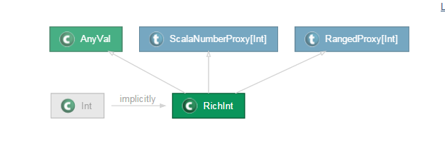

# Scala类型参数(一)

类型参数是对泛型的范围进一步的界定，那么介绍类型参数之前先聊聊泛型。Scala类型参数。类型参数是对泛型的范围进一步的界定，那么介绍类型参数之前先聊聊泛型。泛型用于指定方法或类可以接受任意类型参数，参数在实际使用时才 被确定，泛型可以有效的增强程序的使用行，使用泛型可以使得类或者方法具有更强的通用性。泛型的典型应用场景是集合及集合中的方法参数，可以说同java一样，scala中泛型无处不在。

## 类型变量的界定

类型参数是对泛型的范围进一步的界定，对泛型的范围进一步的界定，从而缩小泛型的具体范围，例如：
```scala
// 下面的类编译通不过
// 因为泛型T在编译时不能确定其具体类型
// 并不是所有的类都存在compareTo方法
class TypeVariableBound{
  def compare[T](first:T, second:T) = {
    if(first.compareTo(second) > 0) first else second
  }
}

object TypeVariableBound{
  def main(args:Array[String]) : Unit = {
    val tvb = new TypeVariableBound
    println(tvb.compare("A","B"))
  }
}
```
如果在使TypeVariableBound类编译通过，此时可以利用类型变量界定对泛型T进行界定，指明所有的泛型T都实现了Comparable接口，代码如下：
```scala
// 下面的类编译通不过
// 因为泛型T在编译时不能确定其具体类型
// 并不是所有的类都存在compareTo方法
class TypeVariableBound{
  def  compare[T <: Comparable[T]](first:T, second:T) = {
    if(first.compareTo(second) > 0) first else second
  }
}

object TypeVariableBound{
  def main(args:Array[String]) : Unit = {
    val tvb = new TypeVariableBound
    println(tvb.compare("A","B"))
  }
}
```
上面的类型变量界定都是作用于方法compare上，类型变量界定除了作用于方法上外，还可以对类中泛型进行范围限定，例如：
```scala
// 定义Student类为case class，且泛型T的类型变量界定为AnyVal
// 在创建类时，所有处于AnyVal类继承层次结构的类都是合法的
// 如Int、Double等值类型
case class Student[S,T <: AnyVal](name:S, height:T)
object TypeVariableBound{
  def main(args:Array[String]):Unit = {
    // 下面这条语句是非法的，因为String类型不属于
    // AnyVal类层次结构
    // val s1 = Student("john","170")
    // 下面这两条语句都是合法的，因为
    // Int,Long类型都是AnyVal
    val s2 = Student("jhon",178)
    val s3 = Student("jhon",178L)
  }
}
```
从上面的例子中不难看出，类型变量界定可以对方法和类中的泛型进行范围界定，这种界定建立在类继承层次结构的基础上，通过`<:`符号将泛型的范围进一步减少。

## 2 视图界定(View Bound)

上一节将类型变量界定建立在类层次结构的基础上，但有时候这种限定不能满足实际需求，如果希望跨越类继承层次结构时，可以使用视图界定来实现，其后面的原理是通过隐式转换来实现的。视图界定利用`<%`符号来实现。
```scala
// 利用<%符号对泛型S进行限定
// 它的意思可以是Comparable类继承层级结构
// 中实现了Comparable接口的类
// 也可以是能够经过隐式转换得到的类，该类实现了
// Comparable接口
case class Student[T,S <% Comparable[S]](name:T,height:S)

object ViewBound extends App{
  val s = Student("john","175")
  // 下面这条语句在视图界定中是合法的
  // 因为Int类型此时会隐式转换为RichInt类
  // RichInt类实现了Comparable特质
  val s = Student("john",175)
}
```
查看Scala API文档可以看到



Int类会隐式转换为RichInt类，RichInt并不是直接实现Comparable接口，而是通过ScalaNumberProxy类将Comparable中的方法继承过来：


ScalaNumberProxy混入了OrderedProxy，而OrderedProxy又混入了Ordered


trait Ordered混入了Comparable接口

可以看到，视图界定比类型变量界定的限制要宽松一点，它不但可以是类继承中的类，也可以是通过隐式转换进行的。

## 3 上界(Upper Bound)下界(Lower Bound)

例如T <: AnyVal表示泛型T的类型的最顶层类是AnyVal，所有输入是AnyVal的子类都是合法的，其它的都是非法的，因为被称为上界,下界通过符号`>:`表示。
```scala
class Pair1[T](val first:T,val second:T){
  //下界通过[R >: T]的意思是
  //泛型R的类型必须是T的超类
  def replaceFirst[R >: T](newFirst:R)= new Pair1[R](newFirst,second)
  override def toString()=first+"---"+second
}

//Book类
class Book(val name:String){
  override def toString()="name--"+name
}
//Book子类Ebook
class Ebook(name:String) extends Book(name)
//Book子类Pbook
class Pbook(name:String) extends Book(name)
//Pbook子类,WeridBook
class WeirdBook(name:String) extends Pbook(name)

object LowerBound extends App{

   val first = new Ebook("hello")
   val second = new Pbook("paper book")


   val p1 = new Pair1(first,second)
   println(p1)
    //scala> val p1 = new Pair1(first,second)
   //p1: Pair1[Book] = name--hello---name--paper book
   //Ebook,Pbook，最终得到的类是Pair1[Book]

   val newFirst = new Book("generic pBook")
   val p2 = p1.replaceFirst(newFirst)
   //p2: Pair1[Book] = name--generic pBook---name--paper book
   println(p2)

   val weirdFirst:WeirdBook= new WeirdBook("generic pBook")
   val p3 = p1.replaceFirst(weirdFirst)
   //p3: Pair1[Book] = name--generic pBook---name--paper book

   val p4 = new Pair1(second,second)
   //p4: Pair1[Pbook] = name--paper book---name--paper book
   println(p4)
   val thirdBook=new Book("Super Books")
   val p5=p4.replaceFirst(thirdBook)
   println(p5)

   //下面这条语句会报错
   //type mismatch; found : cn.scala.xtwy.lowerbound.Pair1[cn.scala.xtwy.lowerbound.Pbook] required: cn.scala.xtwy.lowerbound.Pbook
   val p6:Pbook=p4.replaceFirst(weirdFirst)
}
```
通过上述代码发现，如果newFirst的类型刚好是T的基类，R就直接是newFirst的类型。如果newFirst的类型不是T的基类，那R就会是T和newFirst的类型的共同基类。当限定返回变量类型时，例如val p6:Pbook=p4.replaceFirst(weirdFirst)，由于p4为`Pair1[Pbook]`，也即T为Pbook类型，而`replaceFirst(weirdFirst)`中的weirdFirst为Pbook的子类，违反了`R>:T`的下界限定，从而编译出错。从这里我们可以看到，下界的作用主要是保证类型安全。

## 参考博文

[https://yq.aliyun.com/articles/60378?spm=5176.8251999.569296.17.3d10f3b6mLAnf](https://yq.aliyun.com/articles/60378?spm=5176.8251999.569296.17.3d10f3b6mLAnf)
