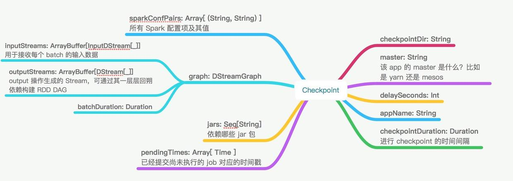

# Spark Streaming缓存、Checkpoint机制

## 1 Spark Stream 缓存

Dstream是由一系列的RDD构成的，它同一般的RDD一样，也可以将流式数据持久化，采用同样的persisit方法，调用该方法后DStream将持久化所有的RDD数据。这对于一些需要重复计算多次或者数据需要反复被 使用的DStream特别有效。像reduceByWindow、reduceByKeyAndWindow等基于窗口操作的方法，它们默认都是有persisit操作的。而且不需要程序员手动设置。

### 1.1 Dstream支持的persisit级别

|                存储级别                |                                                                           解释                                                                            |
| -------------------------------------- | --------------------------------------------------------------------------------------------------------------------------------------------------------- |
| MEMORY_ONLY                            | 将RDD作为非序列化的Java对象存储在jvm中。如果RDD不适合存在内存中，一些分区将不会被缓存，从而在每次需要这些分区时都需重新计算它们。这是系统默认的存储级别。 |
| MEMORY_AND_DISK                        | 以反序列化的JAVA对象的方式存储在JVM中. 如果内存不够， RDD的一些分区将将会缓存在磁盘上，再次需要的时候从磁盘读取                                           |
| MEMORY_ONLY_SER                        | 以序列化JAVA对象的方式存储 (每个分区一个字节数组). 相比于反序列化的方式,这样更高效的利用空间， 尤其是使用快速序列化时。但是读取是CPU操作很密集。          |
| MEMORY_AND_DISK_SER                    | 与MEMORY_ONLY_SER相似, 区别是但内存不足时，存储在磁盘上而不是每次重新计算                                                                                 |
| DISK_ONLY                              | 只存储RDD在磁盘                                                                                                                                           |
| MEMORY_ONLY_2, MEMORY_AND_DISK_2, etc. | 与上面的级别相同，只不过每个分区的副本只存储在两个集群节点上。                                                                                            |
| OFF_HEAP (experimental)                | 与MEMORY_ONLY_SER类似，但将数据存储在非堆内存中。这需要启用非堆内存。                                                                                     |

## 2 Checkpoint机制

Spark Streaming应用程序如果不手动停止，则将一直运行下去，在实际中应用程序一般是24小时*7天不间断运行的，因此Streaming必须对诸如系统错误，JVM出错等与程序逻辑无关的错误(failures)具体很强的弹性，具备一定的非应用程序出错的容错性。Spark Streaming的Checkpoint机制便是为此设计的，它将足够多的信息checkpoint到某些具备容错性的存储系统如hdfs上，以便出错时能够迅速恢复。有两种数据可以checkpoint：

- Metadata checkpointing
> 将流式计算的信息保存到具备容错性的存储上比如HDFS，Metadata Checkpointing适用于当streaming应用程序Driver所在的节点出错时能够恢复，元数据包括：
> Configuration(配置信息) : 创建streaming应用程序的配置信息
> Dstream operations : 在streaming应用程序中定义的DStreaming操作
> Incomplete batches : 在队列中没有处理完的作业

- Data checkpointing
> 将生成的RDD保存到外部可靠的存储当中，对于一些数据跨度为多个batch的有状态transforation操作来说，checkpoint非常有必要，因为在这些transformation操作生成的RDD对前一RDD有依赖，随着时间的增加，依赖链可能非常长，checkpoint机制能够切断依赖链，将中间的RDD周期性地checkpoint到可靠存储当中，从而在出错时可以直接从checkpoint点恢复。
> 具体来说，metadata checkpointing主要还是从driver失败中恢复，而Data Checkpoint用于对有状态的transformation操作进行checkpointing

## 3 什么时候需要启用checkpoint？

什么时候该启用checkpoint？满足一下任意条件：
- 使用了stateful转换，如果application中使用了updateStateByKey或者reduceByKeyAndWindow等stateful操作，必须提供checkpoint目录来允许定时的RDD checkpoint
- 希望能从意外中恢复driver

如果streaming app没有stateful操作，也允许friver挂掉之后再次重启 的进度丢失，就没有启动checkpoint的必要了。

## 4 如何使用checkpoint？

启用checkpoint，需要设置一个支持容错的、可靠的文件系统(如hdfs、s3等)目录来保存checkpoint数据。通过调用`streamingContext.checkpoint(checkpointDirectory)`来完成。另外 ，如果你 想让你的application能从driver失败中恢复，你的application要满足 :
- 若application为首次重启，将创建一个新的StreamContext实例
- 如果application是从失败中重启，将会从checkpoint目录导入checkpoint数据来重新创建StreamingContext实例。

通过`StreamingContext.getOrCreate`可以达到目的:
```
// Function to create and setup a new StreamingContext
def functionToCreateContext():StreamingContext = {
  val ssc = new StreamingContext(...) // new context
  val lines = ssc.socketTextStream(...) // create Dstreams
  ...
  ssc.checkpoint(ckeckpointDirectory) // set checkpoint directory
  ssc
}

// Get SteamingContext from checkpoint data or create a new one
val context = StreamingContext.getOrCreate(ckeckpointDirectory,functionToCreateContext _)

// Do additional setup on context that needs to be done,
// irrespective of whether it is being started or restarted

context. ....

// start the context
context.start()
context.awitTermination()
```

如果checkpointDirecrory存在，那么context将导入checkpoint数据。如果目录不存在，函数functionToCreateContext将被调用并创建新的context除调用getOrCreate外，还需要你的集群模式支持driver挂掉之后重启。例如，在yarn模式下，driver是运行在ApplicationMaster中，若ApplicationMaster挂掉，yarn会自动在另一个节点上启动一个新的ApplicationMaster。

需要注意的是，随着streaming application的持续运行，checkpoint数据占用的存储空间会不断变大。因此，需要小心设置checkpoint的时间间隔。设置的越小 ，checkpoint次数会越多，占用空间会越大；如果设置越大，会导致恢复时丢失的数据和进度越多。一般推荐设置为batch duration的5~10倍。

## 5 导出checkpoint数据

上文提到，checkpoint数据会定时导出到可靠的存储系统，那么：
1. 在什么时候进行checkpoint ?
2. checkpoint的形式是怎么样的 ?

### 5.1 checkpoint的时机

在spark Streaming中，JobGenerator用于生成每个batch对应的jobs，它有一个定时器，定时器 的周期即初始化StreamingContext时设置batchDuration。这个周期一到，JobGenerator将调用generateJobs方法来生成并提交jobs，这之后调用doCheckpoint方法来进行checkpoint。doCheckpoint方法中，会判断 当前时间与streaming application start的时间只差是否是 checkpoint duration的倍数，只有在是的情况下才进行checkpoint。

### 5.2 checkpoint的形式

最终checkpoint的形式是将类Checkpoint的实例序列化后写入外部存储，值得一提的是，有专门的一条线程来做序列化后的checkpoint写入外部存储。类Checkpoint包含以下数据：



除了Checkpoint类，还有CheckpointWriter类用来导出checkpoint，CheckpointReader用来 导入checkpoint

## 6 案例

```scala
import java.io.File
import java.nio.charset.Charset

import com.google.common.io.Files

import org.apache.spark.SparkConf
import org.apache.spark.rdd.RDD
import org.apache.spark.streaming.{Time, Seconds, StreamingContext}
import org.apache.spark.util.IntParam

/**
 * Counts words in text encoded with UTF8 received from the network every second.
 *
 * Usage: RecoverableNetworkWordCount <hostname> <port> <checkpoint-directory> <output-file>
 *   <hostname> and <port> describe the TCP server that Spark Streaming would connect to receive
 *   data. <checkpoint-directory> directory to HDFS-compatible file system which checkpoint data
 *   <output-file> file to which the word counts will be appended
 *
 * <checkpoint-directory> and <output-file> must be absolute paths
 *
 * To run this on your local machine, you need to first run a Netcat server
 *
 *      `$ nc -lk 9999`
 *
 * and run the example as
 *
 *      `$ ./bin/run-example org.apache.spark.examples.streaming.RecoverableNetworkWordCount \
 *              localhost 9999 ~/checkpoint/ ~/out`
 *
 * If the directory ~/checkpoint/ does not exist (e.g. running for the first time), it will create
 * a new StreamingContext (will print "Creating new context" to the console). Otherwise, if
 * checkpoint data exists in ~/checkpoint/, then it will create StreamingContext from
 * the checkpoint data.
 *
 * Refer to the online documentation for more details.
 */
object RecoverableNetworkWordCount {

  def createContext(ip: String, port: Int, outputPath: String, checkpointDirectory: String)
    : StreamingContext = {


    //程序第一运行时会创建该条语句，如果应用程序失败，则会从checkpoint中恢复，该条语句不会执行
    println("Creating new context")
    val outputFile = new File(outputPath)
    if (outputFile.exists()) outputFile.delete()
    val sparkConf = new SparkConf().setAppName("RecoverableNetworkWordCount").setMaster("local[4]")
    // Create the context with a 1 second batch size
    val ssc = new StreamingContext(sparkConf, Seconds(1))
    ssc.checkpoint(checkpointDirectory)

    //将socket作为数据源
    val lines = ssc.socketTextStream(ip, port)
    val words = lines.flatMap(_.split(" "))
    val wordCounts = words.map(x => (x, 1)).reduceByKey(_ + _)
    wordCounts.foreachRDD((rdd: RDD[(String, Int)], time: Time) => {
      val counts = "Counts at time " + time + " " + rdd.collect().mkString("[", ", ", "]")
      println(counts)
      println("Appending to " + outputFile.getAbsolutePath)
      Files.append(counts + "\n", outputFile, Charset.defaultCharset())
    })
    ssc
  }
  //将String转换成Int
  private object IntParam {
  def unapply(str: String): Option[Int] = {
    try {
      Some(str.toInt)
    } catch {
      case e: NumberFormatException => None
    }
  }
}
  def main(args: Array[String]) {
    if (args.length != 4) {
      System.err.println("You arguments were " + args.mkString("[", ", ", "]"))
      System.err.println(
        """
          |Usage: RecoverableNetworkWordCount <hostname> <port> <checkpoint-directory>
          |     <output-file>. <hostname> and <port> describe the TCP server that Spark
          |     Streaming would connect to receive data. <checkpoint-directory> directory to
          |     HDFS-compatible file system which checkpoint data <output-file> file to which the
          |     word counts will be appended
          |
          |In local mode, <master> should be 'local[n]' with n > 1
          |Both <checkpoint-directory> and <output-file> must be absolute paths
        """.stripMargin
      )
      System.exit(1)
    }
   val Array(ip, IntParam(port), checkpointDirectory, outputPath) = args
    //getOrCreate方法，从checkpoint中重新创建StreamingContext对象或新创建一个StreamingContext对象
    val ssc = StreamingContext.getOrCreate(checkpointDirectory,
      () => {
        createContext(ip, port, outputPath, checkpointDirectory)
      })
    ssc.start()
    ssc.awaitTermination()
  }
}
```

## 7 Checkpoint的局限

Spark Streaming的checkpoint机制看起来很美好，却有一个硬伤。上文提到 最终刷到外部存储的是类Checkpoint对象序列化后的数据。那么在Spark Streaming application重新编译后，再去反序列化checkpoint数据就会失败。这个时候就必须新建StreamingContext。


## 参考博文

[http://spark.apache.org/docs/latest/streaming-programming-guide.html](http://spark.apache.org/docs/latest/streaming-programming-guide.html)

[https://yq.aliyun.com/articles/60313?spm=5176.8251999.569296.79.5741a557mjFgAo](https://yq.aliyun.com/articles/60313?spm=5176.8251999.569296.79.5741a557mjFgAo)

[http://www.jianshu.com/p/00b591c5f623](http://www.jianshu.com/p/00b591c5f623)
