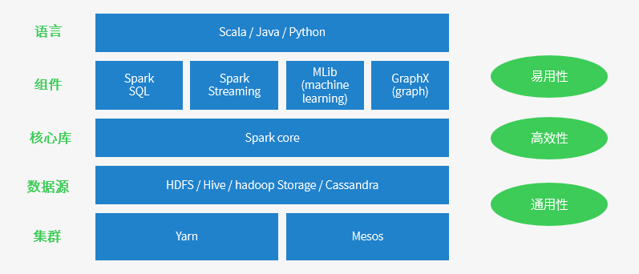
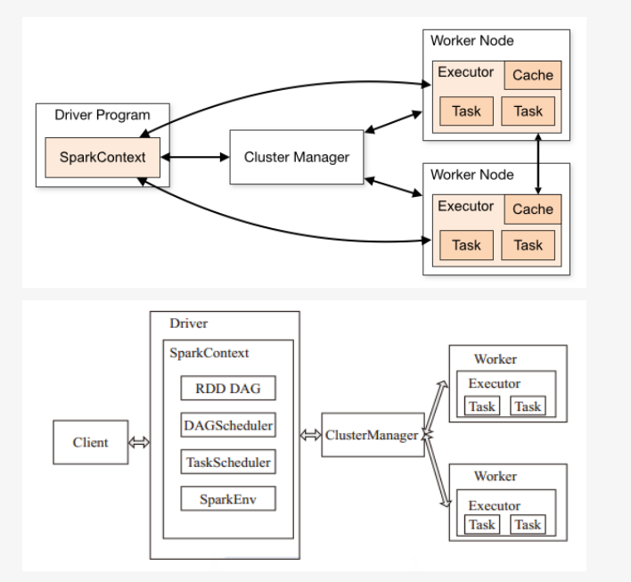
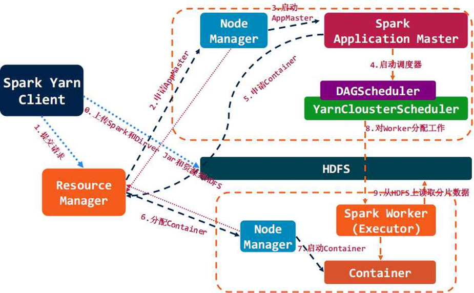
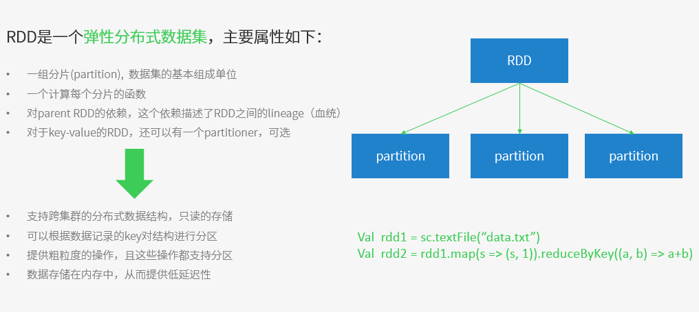
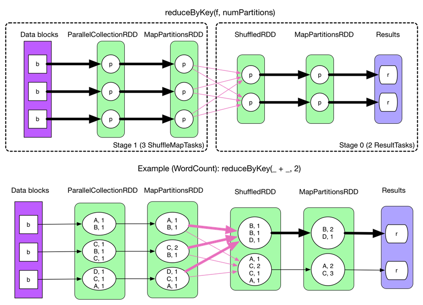
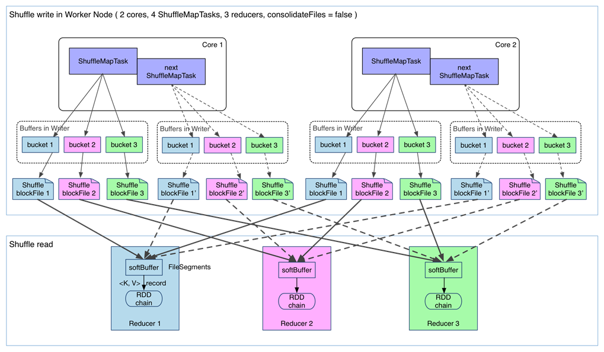
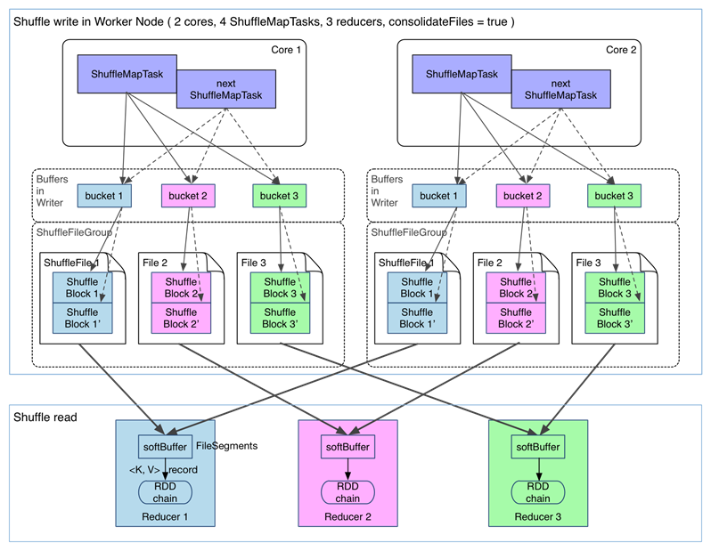

# spark 生态及运行原理

## spark 特点

1. 运行速度快 => Spark拥有DAG执行引擎，支持在内存中对数据进行迭代计算。
2. 适用场景广泛 => 大数据分析统计，实时数据处理，图计算及机器学习
3. 易用性 => 编写见到那，支持80多种以上的高级算子，支持多种语言，数据源丰富，可部署在多种集群中
4. 容错性高 => Spark引进了弹性分布式数据集RDD，它是分布在一组节点中的只读对象集合，这些集合是弹性的，如果数据集一部分丢失，则可以根据“血统”(即允许基于数据衍生过程)对他们进行重建。另外在RDD计算时可以通过Checkpoint来实现容错，而Checkpoint有两种方式：Checkpoint Data和Logging The Updates，用户可以控制采用哪种方式来实现容错。

## Spark的适用场景

目前大数据处理场景有以下几个类型：

1. 复杂的批量处理(Batch Data Processing)，偏重点在于处理海量数据的能力，至于处理速度可忍受，通常的时间可能实在数十分钟到数小时；
2. 基于历史数据的交互式查询(Interactive Query),通常的时间在数十秒到数十分钟之间；
3. 基于实时数据流的数据处理(Streaming Data Processing),通常是在数百毫秒到数秒之间

## Spark运行架构

spark基础运行结构如下图所示：

spark结合yarn集群背后的运行流程如下图所示：

### spark 运行流程

spark架构采用了分布式计算中的Master-Slave模型。Master是对应集群中的含有Master进程的节点，Slave是集群中含有Worker进程的节点。Master作为整个集群的控制器，负责整个集群的正常运行；Worker相当于计算节点，接受主节点命令与进行状态汇报；Executor负责任务的执行；Client作为用户的客户端负责提交应用，Driver负责控制一个应用的执行。Spark集群部署后，需要在主节点和从节点分别启动Master进程和Worker进程，对整个集群进行控制。在一个Spark应用的执行过程中，Driver和Worker是两个重要角色。Driver 程序是应用逻辑执行的起点，负责作业的调度，即Task任务的分发，而多个Worker用来管理计算节点和创建Executor并行处理任务。在执行阶段，Driver会将Task和Task所依赖的file和jar序列化后传递给对应的Worker机器，同时Executor对相应数据分区的任务进行处理。

1. Excecutor /Task 每个程序自有，不同程序互相隔离，task多线程并行
2. 集群对Spark透明，Spark只要能获取相关节点和进程
3. Driver 与Executor保持通信，协作处理

### 三种集群模式

1. Standalone 独立集群
2. Mesos, apache mesos
3. Yarn, hadoop yarn

### 基本概念

- Application => Spark的应用程序，包含一个Driver program和若干个Executor
- SparkContext => Spark应用程序的入口，负责调度哥哥运算资源，协调各个Worker Node上的Executor
- Driver program => 运行Application的main()函数并且创建SparkContext
- Executor => 是为Application运行在Worker Node上的一个进程，该进程负责运行Task，并且负责将数据存在内存或者磁盘上。每个Application都会申请各自的Executor来处理任务
- Cluster Manager => 在集群上获取资源的外部服务(例如：Standalone、Mesos、Yarn)
- Worker Node => 集群中任何可以运行Application代码的节点，运行一个或多个Executor进程
- Task => 运行在Executor上的工作单元
- Job => SparkContext提交的具体Action操作，常和Action对应
- Stage => 每个Job会被拆分成多组task，每组任务被称为Stage，也称为TaskSet
- RDD => 是Resilient distributed datasets的简称，中文为弹性分布式数据集；是Spark最核心的模块和类
- DAGScheduler => 根据Job构建基于Stage的DAG，并提交Stage给TaskScheduler
- TaskScheduler => 将TaskSet提交给Worker node集群运行并返回结果
- Transformations => 是Spark API的一种类型，Transformation返回值还是一个RDD，所有的Transformation采用的是懒值策略，如果只是将Transformation提交时不会执行计算的
- Action => 是Spark API的一种类型，Action返回值不是RDD，而是一个scala集合；计算只有在Action被提交的时候计算才会被触发。

## Spark核心概念之RDD

## Spark核心概念之Shuffle

以reduceByKey为例解释shuffle过程。

**在没有task的文件分片合并下的shuffle过程如下：**(spark.shuffle.consolidateFiles=false)

### fetch来的数据存放到哪里？

刚fetch来的FileSegment存放在softBuffer缓冲区，经过处理后的数据存放在内存+磁盘上。这里我们主要讨论处理后的数据，可以灵活设置这些数据是“只用内存”还是“内存+磁盘”。如果`spark.shuffle.spill=false`就只用内存。由于不要求数据有序，shuffle write的任务很简单：将数据partition好，并持久化。之所以要持久化，一方面是要减少内存存储空间的压力，另一方面也是为了fault-tolerance。

shuffle之所以需要把中间结果放到磁盘文件中，是因为虽然上一批task结束了，下一批task还需要使用内存。如果全部放到内存中，内存会不够。另外一方面为了容错，防止任务挂掉。

### 存在问题如下：

1. 产生的FileSegment过多。每个ShuffleMapTask产生R(reduce个数)个FileSegment，M个ShuffleMapTask就会产生M*R个文件。一般Spark job的M和R都很大，因此磁盘上会存在大量的数据文件。
2. 缓冲区占用内存空间大。每个ShuffleMapTask需要开R和bucket，M个ShuffleMapTask就会产生MR个bucket。虽然一个 ShuffleMapTask 结束后，对应的缓冲区可以被回收，但一个 worker node 上同时存在的 bucket 个数可以达到 cores R 个（一般 worker 同时可以运行 cores 个 ShuffleMapTask），占用的内存空间也就达到了cores R 32 KB。对于 8 核 1000 个 reducer 来说，占用内存就是 256MB。

为了解决上述问题，我们可以使用文件合并的功能。

**在进行task的文件分片合并下的shuffle过程如下：**（spark.shuffle.consolidateFiles=true）

可以明显看出，在一个 core 上连续执行的 ShuffleMapTasks 可以共用一个输出文件 ShuffleFile。先执行完的 ShuffleMapTask 形成 ShuffleBlock i，后执行的 ShuffleMapTask 可以将输出数据直接追加到 ShuffleBlock i 后面，形成 ShuffleBlock i'，每个 ShuffleBlock 被称为 FileSegment。下一个 stage 的 reducer 只需要 fetch 整个 ShuffleFile 就行了。这样，每个 worker 持有的文件数降为 cores * R。FileConsolidation 功能可以通过spark.shuffle.consolidateFiles=true来开启。

## 参考博文

1. [https://cloud.tencent.com/developer/article/1004905](https://cloud.tencent.com/developer/article/1004905)
