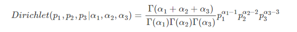
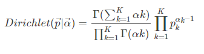
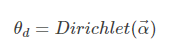
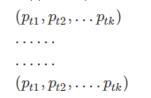
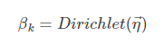
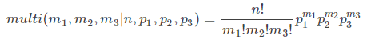

# LDA 主题模型

## 什么是LDA主题模型

首先我们简单 了解一下LDA以及LDA可以用来做什么。
LDA(Latent Dirichlet Allocation)是一种文档生成模型。它认为一篇文章是有多个主题的，而每个主题又对应着多个不同的词。一篇文章的构造过程，首先是以一定的概率选择某个主题，然后再在 这个主题下以一定的概率选出某一个词，这样就生成这篇文章的第一个词。不断重复这个过程，就生成整篇文章。当然这里假设词与词之间是没有顺序的。

LDA的使用是上述文档生成的逆过程，它将根据一篇的到的文章，去寻找出这篇文章的主题，以及这些主题对应的词。

现在来看怎么用LDA，LDA会给我们返回什么结果。

LDA是非监督的机器学习模型，并且使用词袋模型。一篇文章将会用词袋模型构造成词向量。LDA需要我们 手动确定要划分 的主题的个数 ，超参数将会在后面讲述，一般超参数对结果无很大影响。
                                                                     
## 算法流程

我们以文档集合D中的文档d为例，文档d中包含单词序列<w1,w2,...wn> ,wi表示第i个单词 ，设d有 n个单词；

文档集合D中出现的全部词组成Vocabulary;

首先将文档d作为算法的输入，并输入主题数K，此时d对应到各个主题的概率为：
θd=(pt1,pt2,...ptk)，pti为d对应第i个主题的概率；
此时输入到算法中的只有文档d和主题数K，那么pt1,pt2,...ptk的数值从何而来？

我们首先人为设置文档d中对应主题t1,t2,...tk的词的个数，比如文档d中5个词对应主题t1，7个词对应主题t2，…，4个词对应主题tk，那么此时，我们就人为确定了一个参数向量(5,7,…4)，将这个向量记作α⃗ ，这个我们人为设置的参数向量称为**超参数**。 

那么如何将超参数α⃗ 转化为概率分布θd=(pt1,pt2,...ptk)呢？

这里我们引入狄利克雷分布函数：

它所表达的含义简单来说就是，已知α1,α2,α3的条件下，概率p1,p2,p3的概率分布，也就是概率的概率，分布的分布。再直观点说就是：比如在已知α1,α2,α3为(5,7,4)(5,7,4)的条件下，样本点p1,p2,p3为(0.4,0.5,0.1)(0.4,0.5,0.1)的概率是多少。

那么我们将上述的三维Dirichlet函数扩展为K维，即在已知α⃗的条件下，得到p⃗的分布(α⃗ ,p⃗分别为K维向量)。K维Dirichlet公式如下： 

至此，我们通过输入超参数α⃗ 得到了文档d的关于K个主题的狄利克雷分布： 

其含义显然，Dirichlet的输入参数为α⃗ ，得到的输出为可以理解为一个矩阵：

即文档d对应各个主题tk的概率分布的分布。

同理，我们可以将任一主题tk产生各个词的概率表示出来。人为设置主题tk产生的各个词的数量，即设置超参数，用向量η⃗来表示。同上所述，将η⃗作为Dirichlet函数的输入参数，得到主题tk产生各个词的狄利克雷分布：

此时我们已经得到了文档d对应各个主题的概率分布的分布（即狄利克雷分布）θd，以及文档tk产生各个词的概率分布的分布βk，那么接下来，我们要从文档d中取出第i个词，求这个词对应各个主题的分布； 

**换句大家熟悉的话来说就是**：已知第i个词wi在文档d中出现n次，且已知它对应各个主题的概率（这里每个词对应各个主题的概率就是文档d对应各个主题的概率，二者同分布），求该词被各个主题产生的次数； 

这就等同于我们熟知的一共有n个球，且已知红球、黄球、绿球的概率分别为p1,p2,p3，求这n个求当中红球、黄球、绿球的个数。

那么如何通过文档d对应各个主题的分布θd得到文档中的每个词被各个主题产生的次数，进而重新得到文档d中对应各个主题的词的个数呢？

首先我们引入十分熟悉的多项式分布：

> 这个公式的意义总所周知：已知一共n个球，且知道每种颜色球的概率，就可以得到有m1个红球,m2个黄球,m3个绿球的概率。

那么同样将其扩展为K维，将θd作为参数，就可以得到文档d中第i个词wi对应的各个主题的多项式分布zdn=multi(θd) 

于是，非常值得庆幸，我们通过文档d对应各个主题的概率θd，进而得知文档d中各个词对应各个主题的概率，且知道这个词在文档d中的出现次数，于是求得这个词被各个主题的产生次数，遍历文档d中的每一个词，就可以得到新的文档d中对应各个主题的词的个数。

> **白话举例：** 文档d对应主题t1,t2的概率分别为pt1,pt2，于是文档d中词w1对应的主题t1,t2的概率也分别为pt1,pt2，又得知词w1在文档d中出现了15次，于是得到词w1由主题t1,t2产生的次数分别为10次、5次（这个是假设的）; 
>
> 对文档d中的每个词都执行此操作，（假设文档中只有两个词）词w2由主题t1,t2产生的次数分别为13次、2次，于是就能重新得到文档d中对应各个主题的词的数量，即对应主题t1,t2的词的数量分别为2个、0个（初始的d中对应各个主题的词的数量是人为设定的超参数α⃗）。

于是，我们最终得到了文档d对应各个主题的词的个数的更新值：记作向量n⃗ ,我们将更新后的向量n⃗ 再次作为狄利克雷分布的输入向量，即Dirichlet(θd|n⃗ )
就会又会得到文档d对应各个主题的概率的更新值，即更新的θd，如此反复迭代，最终得到收敛的θd，即为我们要的结果。

有了以上的经验，主题tk产生各个词的概率βk可以同样处理，对于产生文档d中的第i个词wi的各个主题的分布为： 
multi(βi),于是用同上面相同的方法，可以得到更新后的各个主题产生各个单词的数量：记作向量m⃗ ，将向量m⃗ 作为新的参数再次带入狄利克雷分布Dirichlet(βk|m⃗ ),就又会得到每个主题产生各个词的概率，即更新的βk，如此反复迭代，最终得到收敛的βk,即所求结果。

得到了收敛的θd和βk，算法就大功告成了，这时，该算法就会根据输入的文档d，找到潜在主题下的相关词啦！！！！

## 参考博文

[https://blog.csdn.net/weixin_41090915/article/details/79058768](https://blog.csdn.net/weixin_41090915/article/details/79058768)

[https://www.cnblogs.com/fengsser/p/5836677.html](https://www.cnblogs.com/fengsser/p/5836677.html)