# 似然与极大似然估计

## 似然与概率

在统计学中，似然函数(likelihood function,通常简写为likelihood，似然)是一个非常重要的内容，在非正式场合似然和概率(Probability)几乎是一对同义词，但是在统计学中似然和概率确是两个不同的概率。概率在特定的环境下某件事情发生的可能性，也就是结果没有产生之前依据环境锁对应的参数来预测某件事情发生的可能性，比如抛硬币，抛之前我们不知道最后是哪一面朝上，但是根据硬币的性质我们可以推测任何一面朝上的肯能行均为50%，这个概率只有抛硬币之前才有意义，抛完硬币后的结果便是确定的；而似然刚好相反，是在确定的结果下去推测产生这个结果的可能环境(参数)，还是抛硬币的例子，假设我们随机抛掷一枚硬币1,000次，结果500次人头朝上，两面朝上的概率均为50%，这个过程就是我们运用出现的结果来判断这个事情本身的性质(参数),也就是似然。

结果和参数相互对应的时候，似然和概率在数值上是相等的，如果用θ表示环境对应的参数，x表示结果，那么概率可以表示为: **P(x|θ)**

p(x|θ)是条件概率的表示方法，θ是前置条件，理解为在θ的前提下，事件x发生的概率，相对应的似然可以表示为:**L(θ|x)**

可以理解为已知结果为x，参数为θ(似然函数里θ是变量，这里说的参数和变量是相对于概率而言的)对应的概率，即：
**L(θ|x) = P(x|θ)**

需要说明的是两者在数值上相等，但是意义并不同，L是关于θ的函数，而P则是关于x的函数，两者从不同的角度描述一件事情。

## 举个例子

以伯努利分布(Bernoulli distribution,又称作两点分布或0-1分布)为例：

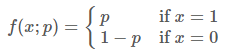

也可以写成一下形式：

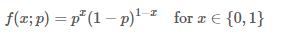

这里注意区分f(x;p)与前面的条件概率的区别，引号后的p仅表示f依赖于p的值，p并不是f的前置条件，而只是这个概率分布的一个参数而已，也可以省略引号后的内容：

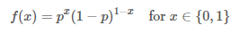

对于任意的参数p我们都可以画出伯努利分布的概率图，当p=0.5时：

f(x) = 0.5

我们可以得到下面的概率密度图：

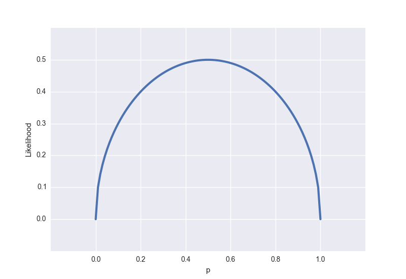

从似然的角度出发，假设我们观测到的结果是x = 0.5(即某一面朝上的概率是50%，这个结果可能是通过几千次几万次的试验得到的，总之我们现在知道了这个结论),可以得到以下的似然函数：

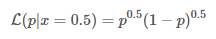

对应的图是这样的：

与概率分布不同的是，似然函数是一个(0,1)内连续的函数，所以得到的图也是连续的，我们很容易看出似然函数的极值(也是最大值)在p=0.5处得到，通常不需要做图来观察极值，令似然函数的偏导数为零即可求得极值条件。

**Ps.**似然函数里的p描述的是硬币的性质而非时间发生的概率（比如p=0.5描述的是一枚两面均匀的硬币）。为了避免混淆，可以用其他字母来表示这个性质，如果我们用 π 来表示，那么似然函数就可以写成：

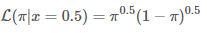

## 似然函数的最大值

似然函数的最大值意味着什么？让我们回到概率和似然的定义，概率描述的是在一定的条件下某个时间的可能发生的可能性，概率越大说明这个事情越可能发生；而似然描述的是结果已知的情况下，该事件在不同条件的发生可能性，似然函数的值越大说明该事件在对应的条件下发生的肯能行越大。

现在再来看看之前提到的抛硬币的例子：

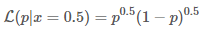

上面的 p（硬币的性质）就是我们说的事件发生的条件，L 描述的是性质不同的硬币，任意一面向上概率为50%的可能性有多大，是不是有点绕？让我们来定义 A：

A=事件的结果=任意一面向上概率为50%

那么 L 描述的是性质不同的硬币，A 事件的可能性有多大，这么一说是不是清楚多了？

在很多实际问题中，比如机器学习领域，我们更关注的是似然函数的最大值，我们需要根据已知事件来找出产生这种结果最有可能的条件，目的当然是根据这个最有可能的条件去推测未知事件的概率。在这个抛硬币的事件中，p可以取 [0, 1] 内的所有值，这是由硬币的性质所决定的，显而易见的是 p=0.5 这种硬币最有可能产生我们观测到的结果。

## 对数化的似然函数

实际问题往往要比抛一次硬币复杂得多，会涉及到多个独立事件，在似然函数的表达式中通常都会出现连乘：

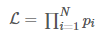

对多项乘积的求导往往非常复杂，但是对于多项求和的求导却要简单的多，对数函数不改变原函数的单调性和极值位置，而且根据对数函数的性质可以将乘积转换为加减式，这可以大大简化求导的过程：

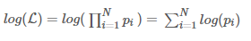

## 极大似然函数例子

### 例一：设样本服从正态分布N(μ,σ),则似然函数为：

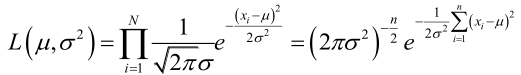

它的对数:

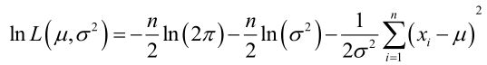

求导，得方程组：

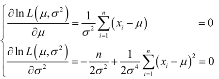

联合解得：

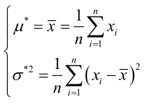

似然方程有唯一解(μ\*,σ\*);而且它一定是最大值点，这是因为当|μ|→∞ 或 σ2→∞或0时，非负函数L(μ,σ2)→0。于是μ和σ2的极大似然估计是(μ\*,σ\*)

### 例二：设样本服从均匀分布[a,b],则X的概率密度函数:

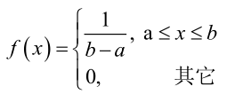

对样本D={x1,x2,x3,···,xn};

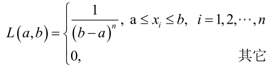

很显然，L(a,b)作为a和b的二元函数是不连续的，这时不能用导数来求解。而必须从极大似然估计的定义出发，求L(a,b)的最大值，为使L(a,b)达到最大，b-a应该尽可能地小，但b又不能小于max{x1,x2,x3,···,xn},否则L(a,b)=0。类似a不能大过min{x1,x2,x3,···,xn},因此，a和b的极大似然估计：

a* = min{x1,x2,x3,···,xn}

b* = max{x1,x2,x3,···,xn}

## 总结

求最大似然估计量θ*的一般步骤：

1. 写出似然函数；
2. 对似然函数取对数，并整理；
3. 求导数；
4. 解似然方程。

## 参考博文

[http://fangs.in/post/thinkstats/likelihood/](http://fangs.in/post/thinkstats/likelihood/)

[https://blog.csdn.net/qq_39355550/article/details/81809467](https://blog.csdn.net/qq_39355550/article/details/81809467)