# 知乎推荐页Ranking经验分享

本次分享主题主要从以下是三个方面展开：

- 知乎推荐页场景和Ranking历程介绍
- 深度学习在Ranking中的尝试和应用现状
- Ranking面临的问题和未来研究方向

首先大家看一下知乎APP的推荐页的推荐结果，由于单厚智老师对机器学习比较感兴趣，所以推荐内容大部分和机器学习相关。

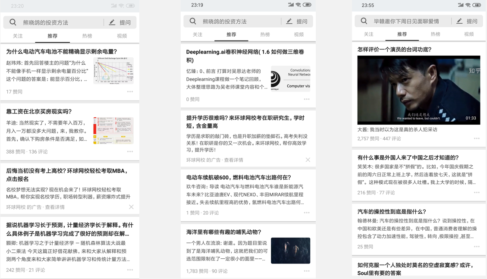

## 一、推荐页请求流程

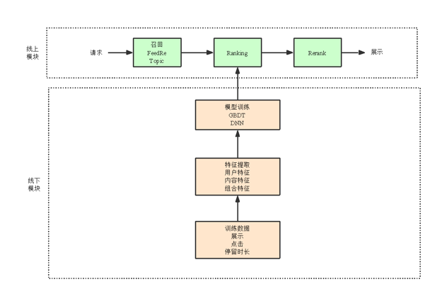

- 召回：负责将用户可能感兴趣的内容提取出来，重点是全
    > - 基于话题：获取用户的关注数据，用户行为挖掘
    > - 基于内容：协同过滤的方式
- 排序：负责对召回的内容进行打分，可以理解为感兴趣程度，重点是准
    > - 基于规则：时间顺序，线性加权
    > - 基于模型：GDBT，DNN
- 重排序：出于产品或业务的考虑，对排序的内容进行重排，最终展示给用户
    > - 提权：比如给视频进行一定的提权
    > - 隔离：相似内容隔开
    > - 强插：高质量的新内容流通
    
以上就是知乎推荐页的整体架构流程，下面针对Ranking模块做详细讲解。

首先介绍一下推荐页Ranking的演进历程,如下图所示，Ranking的演进主要经历了四个阶段。

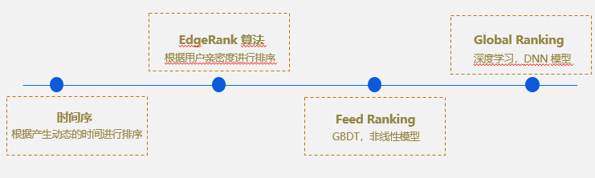

1. 按照时间排序
    > - 按照用户的行为，比如关注，动态等，并根据时间进行排序
    > - 它的问题是没有考虑到亲密度或者感兴趣的程度
2. EdgeRank算法
    > 该算法借鉴Facebook的EdgeRank算法，根据用户亲密度进行排序
3. Feed Ranking
    > 采用GDBT模型
4. Global Ranking
    > 深度学习模型，DNN等

模型的选择主要有以下方面的考量：

- 深度学习大趋势
- 能处理更高维度特征，如几十万话题量级，GBDT 无法完成训练
- 非线性模型，不必做大量的特征组合
- 使用GPU + HDFS结构，可以训练更多的样本

## 二、特征介绍

我们的特征按照内容进行划，可分为如下分三类：

- 用户画像特征
    > - 用户属性特征:性别等
    > - 统计特征：用户点赞数等
- 内容画像
    > - 固有特征：文章长度，关键词等
    > - 统计特征：历史点赞数等
- 交叉特征
    > - 用户与内容的交叉特征:比如用用户感兴趣的话题和当前待推荐内容的话题交叉
    
特征的形式主要有以下几个方面：

- 数值特征：文章长度，点赞数
- Onehot：比如，内容类型
- Multihot：内容多个话题 id
- Onehot with value：用户对单类型内容的感兴趣程度
- Multihot with value ：用户对各话题的感兴趣程度

## 三、特征设计

- **设计原则**
    > - 特征尽量全：从现有的数据中提取尽可能多的特征
    > - 特征原始值全：比如加历史CTR 特征的时候，可以把 pv 和 click 都带上
    > - 覆盖率大：去掉一些覆盖率很低的特征，这些特征影响影响范围小，大部分是缺失值
    > - 线上线下一致：覆盖率和取值分布尽可能接近
- **新特征方向**
    > - 显式交叉特征：DNN 能学习特征的非线性能力，增加交叉特征可以降低模型搜索的空间，在训练数据一定的情况下可以提升效果，如用户的话题兴趣和当前话题的均值和最大值，效果提升明显
    > - 出于业务考虑：需要对业务有一定的理解，把自己当做用户，考虑什么情况下点击率会大，什么样的内容更容易被用户点，比如视频在 wifi 下更容易被点，视频点击率高的人更喜欢视频
    > - 数据挖掘特征：如内容 Embedding 特征

### 3.1 内容Embedding

- Embedding 目的：把内容映射到低纬空间，相似内容距离较近，可以当做内容特征
- 文本角度：tfidf，关键词进行word2vec 等
- 行为角度：考虑用户在知乎的行为，搜索内容相关性较好，依据搜索点击序列设计 Embedding

**实现细节**

1. 数据：将搜索行为进行session切分，组织成类似于 sentence 序列
2. 样本：85亿
3. 模型：skip-gram
 4. loss：nce-loss

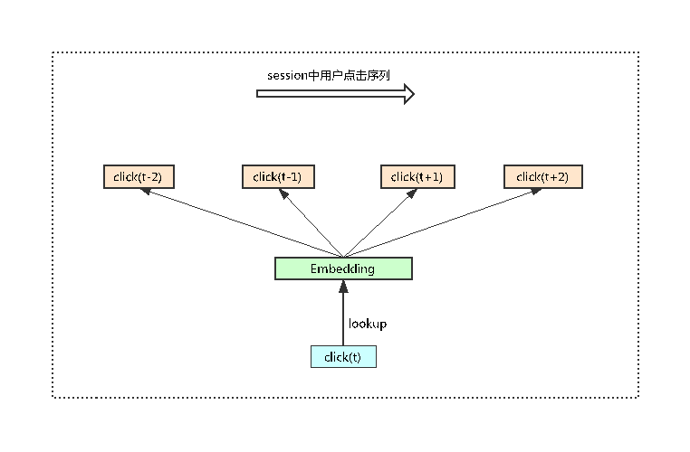

该方法借鉴word2vec的原理,通过“词”去预测“上下文”，这里面的“词”就是itemId，“上下文”就是指在点击该Item事件前后，固定窗口下其他Item的Id信息。

之所以通过搜索行为构建序列，是因为搜索是属于“强目的”的，并且搜索结果内容相似。

下图是模型的训练结果，从结果可以看出，这些内容大体相似。

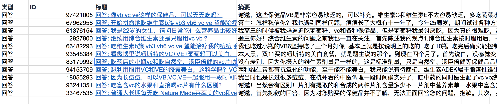

## 四、CTR模型

选择模型的原因：

- 推荐页排序目标是把用户推荐感兴趣的内容排在前面，可有下面两个学习目标
    > - 停留时长：适合用回归问题来解决，最后会偏向于长文章
    > - 点击率：二分类问题，知乎的问答一般不长，更加合适
- 分类问题相比回归问题，目标类别少，相对准确率高
- 分类问题场景业界应用较广，可交流空间大
- 分类问题最后会输出一个概率分，方便与多目标结合

损失函数采用交叉熵：

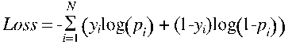

### 4.1 最初DNN结构

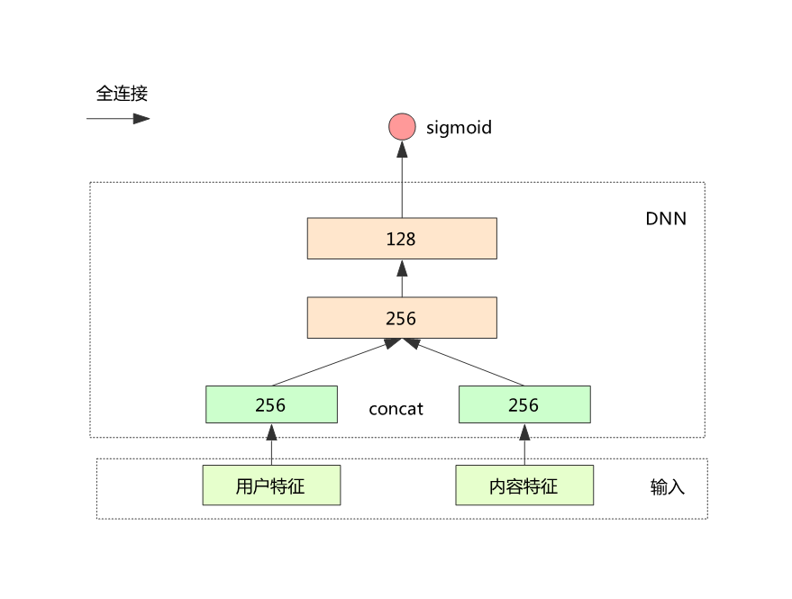

1. 将输入特征分为用户和内容两块
2. 经过特征映射后分别通过全连接与两个独立的隐含层连接
3. 两个独立的隐含层 cancat 后再经过两个全连接层
4. 最后输出 sigmoid 与交叉熵损失作为 loss

**结果**：这一版模型的AUC为0.7618

### 4.2 优化DNN结构

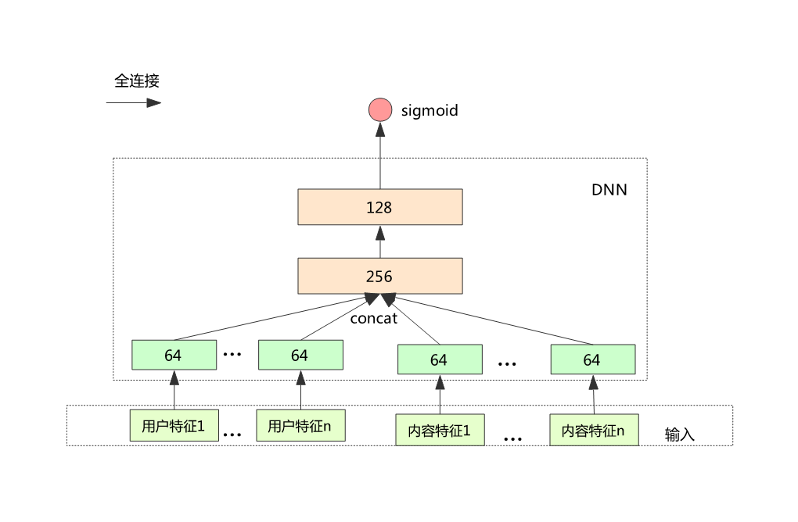

1. 将用户和内容的特征，分别按照内容的 field 分为不同的 block
2. 每个 block 先经过全连接到独立的隐含层
3. 将上面的隐含层 concat 再经过后面的 DNN 模型

**结果**：AUC：0.7678，提升0.6%

### 4.3 Deep FM

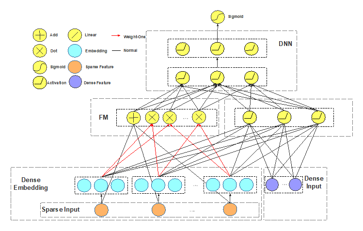

1. 增加了一阶和 FM 模块，FM 通过 block 之间的内积实现
2. AUC 提升 0.2%

该DeepFM算法与华为设计的DeepFM不同，改模型将FM层的结果作为DNN的输入。

### 4.4 Last View + DIN

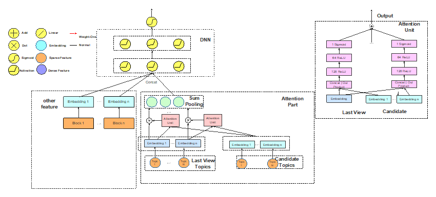

1. Last view topic 与当前内容的几个 topic 计算 Attention Score，再按权重进行 sum pooling
2. AUC 提升约 0.2%

我们基于的考虑是用户过去点击的内容肯定对他2将要点击的内容产生动态影响，这个模型参考了阿里的DIN模型，它会把用户看过的东西Embedding，然后根据Attention Score再乘起来，我们的做法有所不同，我们是基于Topic，是过去用户看过那些Topic下的内容进行划分。

### 4.5 Last Display + GRU

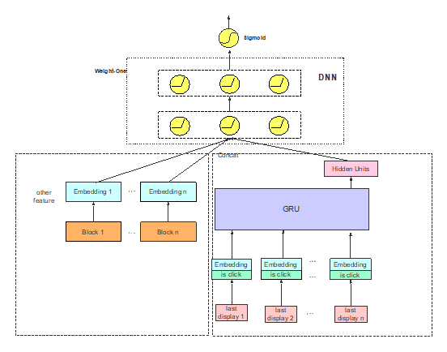

根据4.4的思想，过去点击的行为对现在能够产生影响，那么同理，过去展示的内容中没有点击的内容对当下的点击行为同样会产生影响，所以这里面增加了Last Display(包括点击和没点击的所有数据)。

1. Last Display 经过 Embedding 后与是否点击结合，再进入 GRU 模块，最后状态当做 DNN 输入
2. AUC 提升约 0.4%

### 4.6 多目标

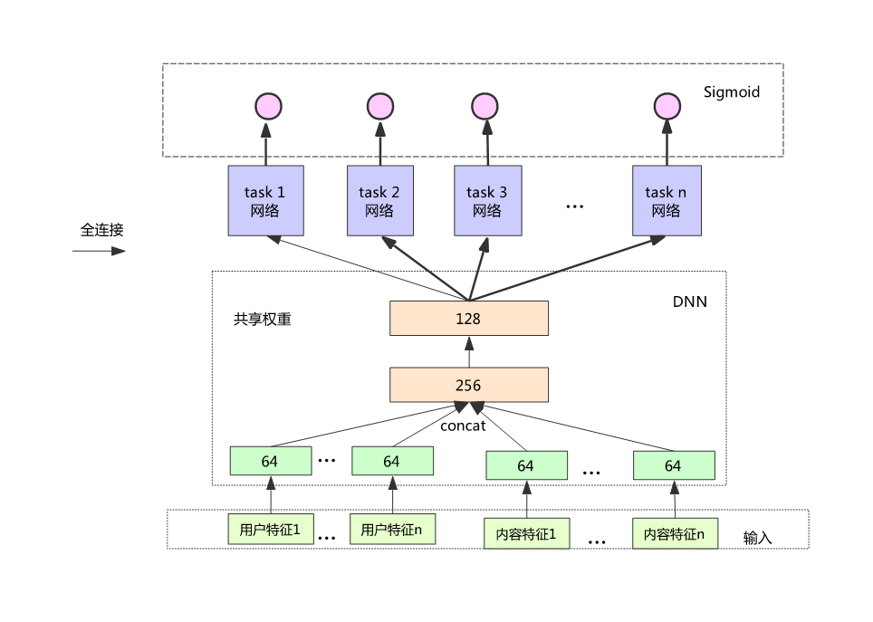

之前所有的模型都是基于CTR为导向来进行设计的，但是这样用户的负反馈可能会比较多一些，因为一些长尾的内容，或者大众化的内容会比较多，影响用户的体验。

后来考虑设计一个多目标模型，一个是基于点击率的模型，一个是基于收藏率的模型，基于点赞率，基于评论率等等，一共设计8个目标。

从性能方面的考虑，我们将底层权重设置成共享的,最后一层会根据不同的目标进行权重的训练。

主要分为以下步骤：

1. 每个 task 共享前面的几层权重，可以节省训练和预测的计算量
2. Loss 可以是几个 task 的 loss 做简单线性加权
3. 上线仍然要确定各个 ctr 的加权值，经验比较重要
4. 上线后线上表现：点击率基本不变，而其他的几个指标，比如点赞，收藏大幅提升

### 4.7 最终模型结构

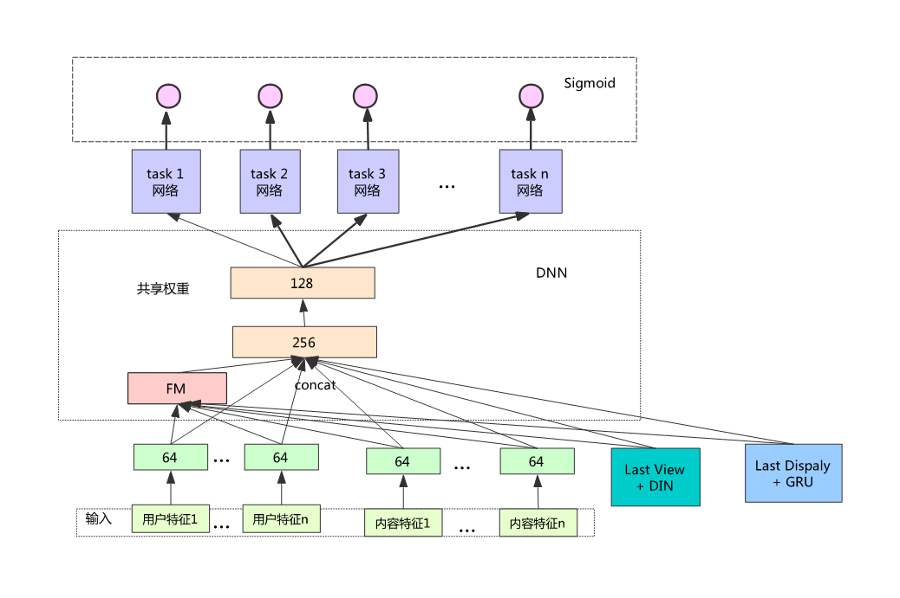

综合以上模型的优点，最终设计出如上图所示的模型。

## 五、经验分享

- 对于随时间变化的统计特征，比如用户和内容画像的统计值，线上 service 应当纪录请求时的值，生成训练样本时直接从纪录的日志里获取，避免特征穿越问题；__
- 如果发现线下效果好，比如 AUC 和 NDCG 提升明显，但上线效果不显著，很可能是特征不一致导致的，可重点排查；
- 线上线下最好使用同一套特征抽取框架，只需使用的相同特征配置便可保证一致性，我们 Global Ranking 使用同一套 proto结构和特征抽取模块实现；
- 做特征归一化操作，发现有特别大的值，比如几万或者几十万，要先取 log ，不然会导致这个特征大部分值都趋向0，相当于征失效；
- 输入特征要做非法检查，防止出现 inf，nan，而导致模型训练出现异常的参数；
- 对于线上的每次请求，用户特征都是一样的，可以只计算一遍用户特征相关的 block，避免冗余运算；
- 训练数据量要尽可能大，可以使用 FlatBuffer 结构把训练数据存放在 HDFS 上，训练时直接从 HDFS 读取，边读取边训练；
- 线上模型要能自动更新，过老的模型效果下降严重；

## 六、面临问题

- 推荐页与搜索页的特性不同
    > - 搜索带着 query 来的，结果与之相关性越高越好，不用太关心结果的多样性
    > - 推荐页用户没有明确的目的，但是有兴趣偏好和对结果的多样性需求，推荐既要准确又要多样化
- CTR 预估模型是 pointwise 模型，没有考虑单个内容与其他内容同时出现的影响
- 用户对感兴趣的东西会出现审美疲劳，要及时抓住这种特点，比如一个算法工程师看完几个机器学习文章后就不想再看了，这时候要能推荐一些其他话题的内容

## 七、未来方向

- 强化学习
    > - Actor：根据用户过去的浏览和点击行为生成推荐页整屏结果
    > - Critic：接收到点击或者其他正向行为作为 reward，同时训练 Critic 和 Actor 网络参数
- 优点
    > - 能及时捕捉用户的反馈，从而避免对同一话题产生审美疲劳
    > - 推荐整屏幕内容，避免 pointwise 方式下内容较为集中问题
- 缺点
    > - 模型结构复杂，模型参数训练较困难
