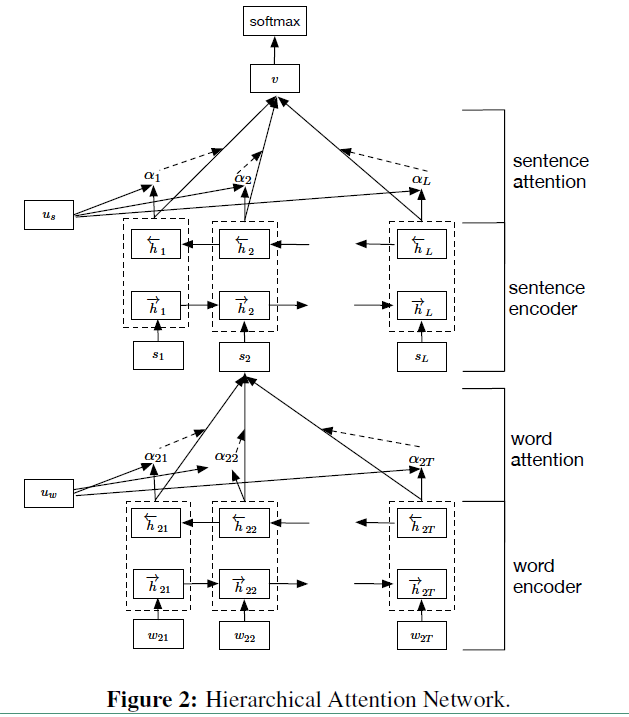
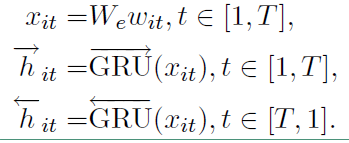
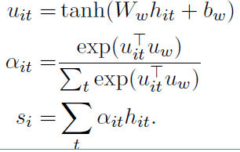
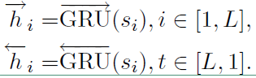
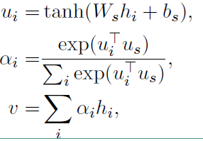
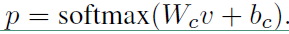
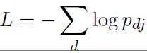

# HAN原理与文本分类

## HAN原理

整个网络结构包含五个部分：

1. 词序列编码器
2. 基于词级的注意力层
3. 句子编码器
4. 基于句子级的注意力层
5. 分类

整个网络结构由双向GRU网络和注意力机制组合而成，具体的网络结构公式如下：

### 1. 词序列编码器

给定一个句子中的单词 wit , 其中i表示第i个句子，t表示第t个词。通过一个词嵌入矩阵We 将单词转换成向量表示，具体如下所示：

xit = We;wit

接下来看看利用双向GRU实现的整个编码流程：

hit = [->hit, <-hit]

### 2. 词级的注意力层

但是对于一句话中的单词，并不是每一个单词对分类任务都是有用的，比如在做文本的情感分类时，可能我们就会比较关注"很好"、“伤感”这些词。为了能使循环神经网络也能自动将“注意力”放在这些词汇上，作者设计了基于单词的注意力层的具体流程如下：

上面式子中，uit是hit的隐藏表示，ait是 经softmax函数处理后的归一化权重系数，uw是一个随机初始化的向量，之后会作为模型的参数一起被训练，si就是我们得到的第i个句子的向量表示。

### 3. 句子编码器

也是基于双向GRU实现编码，其流程如下：

公式和词编码类似，最后的hi也是通过拼接 得到的。

### 4. 句子级注意力层

注意力层的流程如下，和词级的一致：

最后得到的向量v就是文档的向量表示，这是文档的高层表示。接下来就可以用这个向量表示作为文档的特征。

### 5. 分类

使用最常用的softmax分类器对整个文本进行分类

损失函数如下：

